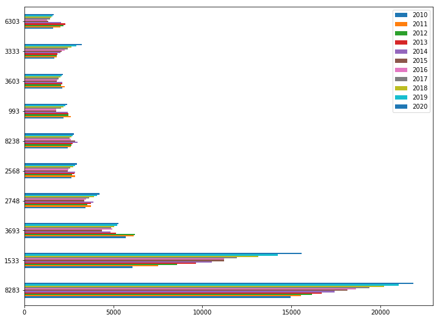
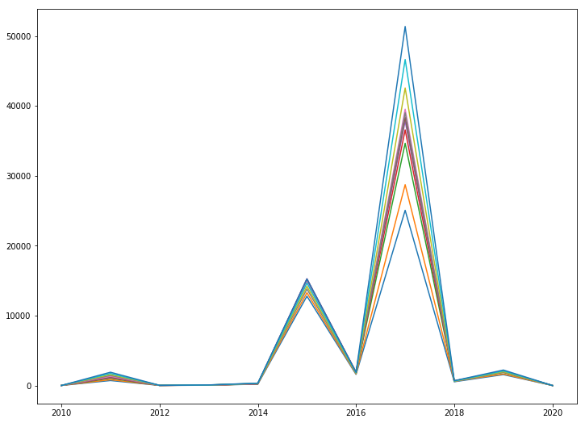
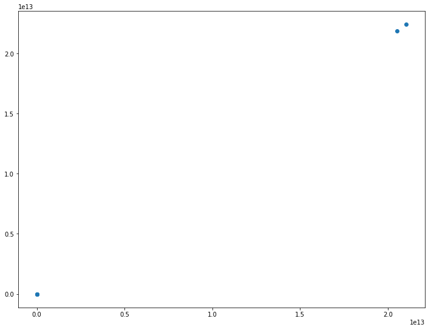

Title: World Economic Outlook Charts
Slug: gdp-charts
Date: 2018-04-23 19:28 
Modified: 2018-04-23 19:28
Category: Python
Tags: Python, Matplotlip, Pandas   
Author: Wahid Contractor
Summary: A quick walkthrough of my thoughts on how to use a real world data sets for some rapid visualiztions.

## Background
It has been some time since my last post.  Life has taken over, with an infant at home and a hectic work schedule it has been difficult to keep up with hobbies. The goal of this post is really to work through a problem and produce some simple vizualization.  I don't want too much dust to pile up.  


```python
#imports
import pandas as pd
import matplotlib.pyplot as plt
import urllib.request
%matplotlib inline
```

## Get Data
For this project I used data set provided by the World Economic Outlook (WEO) database maintained by the International Monetary Foundation (IMF).  They have a readily available, cleaned dataset that represents a complete economic outlook for all the countries of the world.  This data set contains interesting features such as GDP, Population, This was last updated in October 2017. 


```python
#Build a function to get the data from the IMF website and save it locally

URL = 'http://www.imf.org/external/pubs/ft/weo/2017/02/weodata/WEOOct2017all.xls'
def get_data(URL):
    urllib.request.urlretrieve(URL, '/Users/wcontractor/Dev/Python/wcontractor.github.io.git/notebooks/WEOOct2017all.xls')


```


```python
#Run the above function to get the data
#Don't forget to change the path to save this some place local to your computer!!!!!
get_data(URL)
```


```python
#Read the data into a Pandas dataframe
df = pd.read_excel('WEOOct2017all.xlsx', parse_cols='C:E,G,AN:AX')
df.dtypes
```


    WEO Subject Code      object
    Country               object
    Subject Descriptor    object
    Units                 object
    2010                  object
    2011                  object
    2012                  object
    2013                  object
    2014                  object
    2015                  object
    2016                  object
    2017                  object
    2018                  object
    2019                  object
    2020                  object
    dtype: object


## Clean The Data
I noticed all the years of data, which should be number were showing up as objects so I needed to convert them to numeric.  I chose to use the apply method to achieve this.  


```python
df_cleaned = df_years[[2010, 2011, 2012, 2013, 2014, 2015, 2016, 2017, 2018, 2019, 2020]].apply(pd.to_numeric,errors='coerce')
```


```python
#Check to make sure the to_numeric method really worked
df_cleaned[2015].sum()
```


    58008139678241.18


```python
df_labels = df[['WEO Subject Code', 'Country']]
```


```python
df_final = pd.concat([df_labels, df_cleaned],axis=1, join_axes=[df.index])
```


```python
# Get current size
fig_size = plt.rcParams["figure.figsize"]
 
# Prints: [8.0, 6.0]
print("Current size:", fig_size)
```

    Current size: [6.0, 4.0]


```python
# Set figure width to 12 and height to 9
fig_size[0] = 12
fig_size[1] = 9
plt.rcParams["figure.figsize"] = fig_size
plt.show();
```


```python
df_final[df_final['WEO Subject Code']=='NGDPD'].sort_values(2010,ascending=False).head(10).plot(kind="barh")
```


    <matplotlib.axes._subplots.AxesSubplot at 0x10cefe048>





```python
years = [2010, 2011, 2012, 2013, 2014, 2015, 2016, 2017, 2018, 2019, 2020]
plt.plot(years, df_final[years][1:12]);
plt.show();
```





```python
plt.scatter(df_final[2010][1:].sort_values(ascending=False).head(), df_final[2011][1:].sort_values(ascending=False).head())

```


    <matplotlib.collections.PathCollection at 0x1176ed278>




