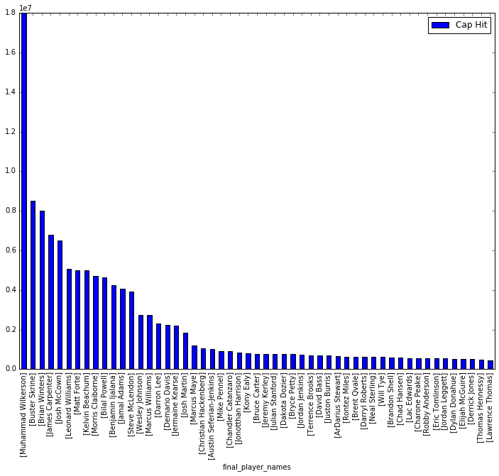
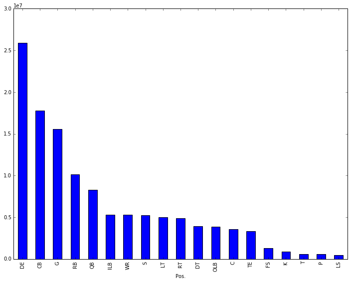

Title:NFL Salary Scraping - Part 1
Date:2017-10-10 10:20
Modified:2010-10-12 19:30
Category:Python, Pelican, misc
Tags:Python, Pandas, Web Scraping, Matplotlib
Slug:nfl-salary   
Authors:Wahid Contractor
Summary:Web Scraping NFL Salary Data Using Python
# NFL Team Salary Scraping - Part 1


### Background and problem statement
I first started thinking about this problem over the 2015-2106 NFL offseason.  During that time one of the biggest stories was the holdout and potential free agency of then Quarterback Ryan Fitzpatrack.  Over the course of the 2015 season Fitzpatrick helped the Jets win 10 games and had career year where he enjoyed personal bests, with nearly 4,000 yards passing and 31 TD passes (a franchise record).  However, the Jets missed the playoffs that year and some argue that Fitzpatrick's play was in a week 17 loss at Buffalo was the contributing factor.  With that in the recordbooks do you really have the ability to demand more tha $8 Million a season?  

The questions I have been looking to answer are:

* What is the value of an NFL Player in relation to some statistic?  Win/Loss ratio, QBR, TD/Interception Ratio?   
* What are the salaries of the top NFL teams?

I'm sure there are many more questions that could be asked of a comprehensive NFL salary dataset: 

* What are the top earning positions of a particular team and relate that to the teams performance in those categories?
* And maybe stretching the limits to making a correlation between the number of twitter mentions of a particular player and their salary.  

I have found there to be shockingly little information about NFL teams and their player salaries on the internet.  While Fantasy football has made player and game statistical information abundantly available the connection of the salary data and the statistics is lacking.  

## Getting Started
spotrac has good salary, bonus, and contract information.  They claim to be:

> Spotrac has become the largest online sports team, & player contract resource on the internet. 

I used this site to get started with the 2017 salary of the NY Jets.  It is my intention to revist this with Part 2 of this post to scrape data for all 32 teams and make a complete NFL Salary dataset.  

## Reading Data and Writing to a File
I leveraged the BeautifulSoup library to accomplish the webscraping and then wrote the soup object out to a file.  This allowed me to just execute the next cell over and over again instead of needing to continually make calls to the website.  


```python
from urllib.request import urlopen
from bs4 import BeautifulSoup
base_url = "http://www.spotrac.com/nfl/new-york-jets/cap/"

def get_page(base_url):
    page = urlopen(base_url)
    soup = BeautifulSoup(page)
    file = open("sample_page.txt", 'w')
    file.write(str(soup))
    file.close()
```

## Reading Data from a File
Execute the above cell once and then start here


```python
with open("sample_page.txt", 'rb') as file:
    for line in file:
        line = line.strip()
```

## Parse the HTML
Import the BeautifulSoup library and use the find method to get the datatable.
It is important to note here, that I opened the sample_page with read binary flags "rb".  Leaving off the binary was causing the parser to puke 6 ways to Sunday.  


```python
# Reimport BeautifulSoup so that I can start here
from bs4 import BeautifulSoup
page = open("sample_page.txt", 'rb')
soup = BeautifulSoup(page, "html.parser")
table = str(soup.find("table","datatable"))


```

## Render the table
Display the HTML table - this is point of reference to understand source data


```python
from IPython.core.display import HTML
HTML(table)

```


<table class="datatable">
<thead>
<tr>
<th class="player">Active Players  (53)</th>
<th class="center">Pos.</th>
<th class="right xs-hide">Base Salary</th>
<th class="right xs-hide"><span class="info" title="The prorated portion of the signing bonus allocated to this year's salary cap.">Signing Bonus</span></th>
<th class="right xs-hide"><span class="info" title="Generally in the form of Actve Roster or Per Game bonuses.">Roster Bonus</span></th>
<th class="right xs-hide"><span class="info" title="The prorated portion of the option bonus allocated to this year's salary cap.">Option Bonus</span></th>
<th class="right xs-hide"><span title="">Workout Bonus</span></th>
<th class="right xs-hide"><span class="info" title="The prorated portion of the restructure bonus allocated to this year's salary cap, which comes from converted base salary.">Restruc. Bonus</span></th>
<th class="right xs-hide"><span class="info" title="Performance, Playing Time, Pro Bowl, etc bonuses.">Misc.</span></th>
<th class="right xs-hide"><span class="info" title="The amount that would remain with the team's cap should the player be traded or released.">Dead Cap</span></th>
<th class="right med"><span class="info" title="The overall salary Cap Hit.">Cap Hit</span></th>
<th class="center">Cap %</th>
</tr>
</thead>
<tbody>
<tr>
<td class="player"><span style="display:none">Wilkerson</span>
<a href="http://www.spotrac.com/redirect/player/7745/">Muhammad Wilkerson</a> </td>
<td class=" center small"><span class="cap" title="">DE</span></td>
<td class=" right xs-hide "><span class="cap ">$14,750,000</span></td>
<td class=" right xs-hide "><span class="cap info" title="Signing Bonus">$3,000,000</span></td>
<td class=" right xs-hide "><span class="cap info" title="Roster Bonus">-</span></td>
<td class="right xs-hide "><span class="cap info" title="Option Bonus">-</span></td>
<td class="right xs-hide "><span class="cap info" title="Workout Bonus">$250,000</span></td>
<td class="right xs-hide "><span class="cap info" title="Restructure Bonus">-</span></td>
<td class="right xs-hide "><span class="cap info" title="Incentive Bonus">-</span></td>
<td class="right xs-hide "><span class="cap info" title="2017 Post June 1: $18,000,000"><a href="#" style="color:#666;text-decoration:underline !important;">($27,000,000)</a></span><input class="d" name="dead[160197]" style="width:75px;display:none" type="text" value="27000000"/></td>
<td class=" right result "><span class="cap info" title="Cap Hit">$18,000,000 </span></td>
<td class=" center ">12.17</td>
</tr>
<tr>
<td class="player"><span style="display:none">Skrine</span>
<a href="http://www.spotrac.com/redirect/player/7856/">Buster Skrine</a> </td>
<td class=" center small"><span class="cap" title="">CB</span></td>
<td class=" right xs-hide "><span class="cap ">$6,000,000</span></td>
<td class=" right xs-hide "><span class="cap info" title="Signing Bonus">$1,250,000</span></td>
<td class=" right xs-hide "><span class="cap info" title="Roster Bonus">-</span></td>
<td class="right xs-hide "><span class="cap info" title="Option Bonus">-</span></td>
<td class="right xs-hide "><span class="cap info" title="Workout Bonus">-</span></td>
<td class="right xs-hide "><span class="cap info" title="Restructure Bonus">$1,250,000</span></td>
<td class="right xs-hide "><span class="cap info" title="Incentive Bonus">-</span></td>
<td class="right xs-hide "><span class="cap info" title="2017 Post June 1: $8,500,000"><a href="#" style="color:#666;text-decoration:underline !important;">($11,000,000)</a></span><input class="d" name="dead[160197]" style="width:75px;display:none" type="text" value="11000000"/></td>
<td class=" right result "><span class="cap info" title="Cap Hit">$8,500,000 </span></td>
<td class=" center ">5.75</td>
</tr>
<tr>
<td class="player"><span style="display:none">Winters</span>
<a href="http://www.spotrac.com/redirect/player/12353/">Brian Winters</a> </td>
<td class=" center small"><span class="cap" title="">G</span></td>
<td class=" right xs-hide "><span class="cap ">$1,000,000</span></td>
<td class=" right xs-hide "><span class="cap info" title="Signing Bonus">-</span></td>
<td class=" right xs-hide "><span class="cap info" title="Roster Bonus">$7,000,000</span></td>
<td class="right xs-hide "><span class="cap info" title="Option Bonus">-</span></td>
<td class="right xs-hide "><span class="cap info" title="Workout Bonus">-</span></td>
<td class="right xs-hide "><span class="cap info" title="Restructure Bonus">-</span></td>
<td class="right xs-hide "><span class="cap info" title="Incentive Bonus">-</span></td>
<td class="right xs-hide "><span class="cap info" title="2017 Post June 1: $22,000,000"><a href="#" style="color:#666;text-decoration:underline !important;">($22,000,000)</a></span><input class="d" name="dead[160197]" style="width:75px;display:none" type="text" value="22000000"/></td>
<td class=" right result "><span class="cap info" title="Cap Hit">$8,000,000 </span></td>
<td class=" center ">5.41</td>
</tr>
<tr>
<td class="player"><span style="display:none">Carpenter</span>
<a href="http://www.spotrac.com/redirect/player/7740/">James Carpenter</a> </td>
<td class=" center small"><span class="cap" title="">G</span></td>
<td class=" right xs-hide "><span class="cap ">$4,450,000</span></td>
<td class=" right xs-hide "><span class="cap info" title="Signing Bonus">$875,000</span></td>
<td class=" right xs-hide "><span class="cap info" title="Roster Bonus">$250,000</span></td>
<td class="right xs-hide "><span class="cap info" title="Option Bonus">-</span></td>
<td class="right xs-hide "><span class="cap info" title="Workout Bonus">-</span></td>
<td class="right xs-hide "><span class="cap info" title="Restructure Bonus">$1,230,000</span></td>
<td class="right xs-hide "><span class="cap info" title="Incentive Bonus">-</span></td>
<td class="right xs-hide "><span class="cap info" title="2017 Post June 1: $6,555,000"><a href="#" style="color:#666;text-decoration:underline !important;">($8,660,000)</a></span><input class="d" name="dead[160197]" style="width:75px;display:none" type="text" value="8660000"/></td>
<td class=" right result "><span class="cap info" title="Cap Hit">$6,805,000 </span></td>
<td class=" center ">4.60</td>
</tr>
<tr>
<td class="player"><span style="display:none">McCown</span>
<a href="http://www.spotrac.com/redirect/player/4944/">Josh McCown</a> </td>
<td class=" center small"><span class="cap" title="">QB</span></td>
<td class=" right xs-hide "><span class="cap ">$3,000,000</span></td>
<td class=" right xs-hide "><span class="cap info" title="Signing Bonus">$3,000,000</span></td>
<td class=" right xs-hide "><span class="cap info" title="Roster Bonus">-</span></td>
<td class="right xs-hide "><span class="cap info" title="Option Bonus">-</span></td>
<td class="right xs-hide "><span class="cap info" title="Workout Bonus">-</span></td>
<td class="right xs-hide "><span class="cap info" title="Restructure Bonus">-</span></td>
<td class="right xs-hide "><span class="cap info" title="Incentive Bonus">$500,000</span></td>
<td class="right xs-hide "><span class="cap info" title="2017 Post June 1: $6,000,000"><a href="#" style="color:#666;text-decoration:underline !important;">($6,000,000)</a></span><input class="d" name="dead[160197]" style="width:75px;display:none" type="text" value="6000000"/></td>
<td class=" right result "><span class="cap info" title="Cap Hit">$6,500,000 </span></td>
<td class=" center ">4.39</td>
</tr>
<tr>
<td class="player"><span style="display:none">Williams</span>
<a href="http://www.spotrac.com/redirect/player/16730/">Leonard Williams</a> </td>
<td class=" center small"><span class="cap" title="">DE</span></td>
<td class=" right xs-hide "><span class="cap ">$615,000</span></td>
<td class=" right xs-hide "><span class="cap info" title="Signing Bonus">$2,952,430</span></td>
<td class=" right xs-hide "><span class="cap info" title="Roster Bonus">$1,513,716</span></td>
<td class="right xs-hide "><span class="cap info" title="Option Bonus">-</span></td>
<td class="right xs-hide "><span class="cap info" title="Workout Bonus">-</span></td>
<td class="right xs-hide "><span class="cap info" title="Restructure Bonus">-</span></td>
<td class="right xs-hide "><span class="cap info" title="Incentive Bonus">-</span></td>
<td class="right xs-hide "><span class="cap info" title="2017 Post June 1: $8,056,718"><a href="#" style="color:#666;text-decoration:underline !important;">($11,009,149)</a></span><input class="d" name="dead[160197]" style="width:75px;display:none" type="text" value="11009149"/></td>
<td class=" right result "><span class="cap info" title="Cap Hit">$5,081,146 </span></td>
<td class=" center ">3.44</td>
</tr>
<tr>
<td class="player"><span style="display:none">Forte</span>
<a href="http://www.spotrac.com/redirect/player/4058/">Matt Forte</a> </td>
<td class=" center small"><span class="cap" title="">RB</span></td>
<td class=" right xs-hide "><span class="cap ">$4,000,000</span></td>
<td class=" right xs-hide "><span class="cap info" title="Signing Bonus">$1,000,000</span></td>
<td class=" right xs-hide "><span class="cap info" title="Roster Bonus">-</span></td>
<td class="right xs-hide "><span class="cap info" title="Option Bonus">-</span></td>
<td class="right xs-hide "><span class="cap info" title="Workout Bonus">-</span></td>
<td class="right xs-hide "><span class="cap info" title="Restructure Bonus">-</span></td>
<td class="right xs-hide "><span class="cap info" title="Incentive Bonus">-</span></td>
<td class="right xs-hide "><span class="cap info" title="2017 Post June 1: $5,000,000"><a href="#" style="color:#666;text-decoration:underline !important;">($6,000,000)</a></span><input class="d" name="dead[160197]" style="width:75px;display:none" type="text" value="6000000"/></td>
<td class=" right result "><span class="cap info" title="Cap Hit">$5,000,000 </span></td>
<td class=" center ">3.38</td>
</tr>
<tr>
<td class="player"><span style="display:none">Beachum</span>
<a href="http://www.spotrac.com/redirect/player/10069/">Kelvin Beachum</a> </td>
<td class=" center small"><span class="cap" title="">LT</span></td>
<td class=" right xs-hide "><span class="cap ">$1,500,000</span></td>
<td class=" right xs-hide "><span class="cap info" title="Signing Bonus">$1,500,000</span></td>
<td class=" right xs-hide "><span class="cap info" title="Roster Bonus">$2,000,000</span></td>
<td class="right xs-hide "><span class="cap info" title="Option Bonus">-</span></td>
<td class="right xs-hide "><span class="cap info" title="Workout Bonus">-</span></td>
<td class="right xs-hide "><span class="cap info" title="Restructure Bonus">-</span></td>
<td class="right xs-hide "><span class="cap info" title="Incentive Bonus">-</span></td>
<td class="right xs-hide "><span class="cap info" title="2017 Post June 1: $9,000,000"><a href="#" style="color:#666;text-decoration:underline !important;">($12,000,000)</a></span><input class="d" name="dead[160197]" style="width:75px;display:none" type="text" value="12000000"/></td>
<td class=" right result "><span class="cap info" title="Cap Hit">$5,000,000 </span></td>
<td class=" center ">3.38</td>
</tr>
<tr>
<td class="player"><span style="display:none">Claiborne</span>
<a href="http://www.spotrac.com/redirect/player/9816/">Morris Claiborne</a> </td>
<td class=" center small"><span class="cap" title="">CB</span></td>
<td class=" right xs-hide "><span class="cap ">$2,500,000</span></td>
<td class=" right xs-hide "><span class="cap info" title="Signing Bonus">$2,000,000</span></td>
<td class=" right xs-hide "><span class="cap info" title="Roster Bonus">$218,750</span></td>
<td class="right xs-hide "><span class="cap info" title="Option Bonus">-</span></td>
<td class="right xs-hide "><span class="cap info" title="Workout Bonus">-</span></td>
<td class="right xs-hide "><span class="cap info" title="Restructure Bonus">-</span></td>
<td class="right xs-hide "><span class="cap info" title="Incentive Bonus">-</span></td>
<td class="right xs-hide "><span class="cap info" title="2017 Post June 1: $4,500,000"><a href="#" style="color:#666;text-decoration:underline !important;">($4,500,000)</a></span><input class="d" name="dead[160197]" style="width:75px;display:none" type="text" value="4500000"/></td>
<td class=" right result "><span class="cap info" title="Cap Hit">$4,718,750 </span></td>
<td class=" center ">3.19</td>
</tr>
<tr>
<td class="player"><span style="display:none">Powell</span>
<a href="http://www.spotrac.com/redirect/player/7845/">Bilal Powell</a> </td>
<td class=" center small"><span class="cap" title="">RB</span></td>
<td class=" right xs-hide "><span class="cap ">$3,750,000</span></td>
<td class=" right xs-hide "><span class="cap info" title="Signing Bonus">$883,333</span></td>
<td class=" right xs-hide "><span class="cap info" title="Roster Bonus">-</span></td>
<td class="right xs-hide "><span class="cap info" title="Option Bonus">-</span></td>
<td class="right xs-hide "><span class="cap info" title="Workout Bonus">-</span></td>
<td class="right xs-hide "><span class="cap info" title="Restructure Bonus">-</span></td>
<td class="right xs-hide "><span class="cap info" title="Incentive Bonus">-</span></td>
<td class="right xs-hide "><span class="cap info" title="2017 Post June 1: $4,633,333"><a href="#" style="color:#666;text-decoration:underline !important;">($5,516,668)</a></span><input class="d" name="dead[160197]" style="width:75px;display:none" type="text" value="5516668"/></td>
<td class=" right result "><span class="cap info" title="Cap Hit">$4,633,333 </span></td>
<td class=" center ">3.13</td>
</tr>
<tr>
<td class="player"><span style="display:none">Ijalana</span>
<a href="http://www.spotrac.com/redirect/player/7768/">Benjamin Ijalana</a> </td>
<td class=" center small"><span class="cap" title="">RT</span></td>
<td class=" right xs-hide "><span class="cap ">$2,000,000</span></td>
<td class=" right xs-hide "><span class="cap info" title="Signing Bonus">$1,000,000</span></td>
<td class=" right xs-hide "><span class="cap info" title="Roster Bonus">$1,250,000</span></td>
<td class="right xs-hide "><span class="cap info" title="Option Bonus">-</span></td>
<td class="right xs-hide "><span class="cap info" title="Workout Bonus">-</span></td>
<td class="right xs-hide "><span class="cap info" title="Restructure Bonus">-</span></td>
<td class="right xs-hide "><span class="cap info" title="Incentive Bonus">-</span></td>
<td class="right xs-hide "><span class="cap info" title="2017 Post June 1: $3,000,000"><a href="#" style="color:#666;text-decoration:underline !important;">($4,000,000)</a></span><input class="d" name="dead[160197]" style="width:75px;display:none" type="text" value="4000000"/></td>
<td class=" right result "><span class="cap info" title="Cap Hit">$4,250,000 </span></td>
<td class=" center ">2.87</td>
</tr>
<tr>
<td class="player"><span style="display:none">Adams</span>
<a href="http://www.spotrac.com/redirect/player/21747/">Jamal Adams</a> </td>
<td class=" center small"><span class="cap" title="">S</span></td>
<td class=" right xs-hide "><span class="cap ">$465,000</span></td>
<td class=" right xs-hide "><span class="cap info" title="Signing Bonus">$3,582,038</span></td>
<td class=" right xs-hide "><span class="cap info" title="Roster Bonus">-</span></td>
<td class="right xs-hide "><span class="cap info" title="Option Bonus">-</span></td>
<td class="right xs-hide "><span class="cap info" title="Workout Bonus">-</span></td>
<td class="right xs-hide "><span class="cap info" title="Restructure Bonus">-</span></td>
<td class="right xs-hide "><span class="cap info" title="Incentive Bonus">-</span></td>
<td class="right xs-hide "><span class="cap info" title="2017 Post June 1: $3,582,038"><a href="#" style="color:#666;text-decoration:underline !important;">($14,328,154)</a></span><input class="d" name="dead[160197]" style="width:75px;display:none" type="text" value="14328154"/></td>
<td class=" right result "><span class="cap info" title="Cap Hit">$4,047,038 </span></td>
<td class=" center ">2.74</td>
</tr>
<tr>
<td class="player"><span style="display:none">McLendon</span>
<a href="http://www.spotrac.com/redirect/player/7100/">Steve McLendon</a> </td>
<td class=" center small"><span class="cap" title="">DT</span></td>
<td class=" right xs-hide "><span class="cap ">$2,875,000</span></td>
<td class=" right xs-hide "><span class="cap info" title="Signing Bonus">$750,000</span></td>
<td class=" right xs-hide "><span class="cap info" title="Roster Bonus">$171,875</span></td>
<td class="right xs-hide "><span class="cap info" title="Option Bonus">$125,000</span></td>
<td class="right xs-hide "><span class="cap info" title="Workout Bonus">-</span></td>
<td class="right xs-hide "><span class="cap info" title="Restructure Bonus">-</span></td>
<td class="right xs-hide "><span class="cap info" title="Incentive Bonus">-</span></td>
<td class="right xs-hide "><span class="cap info" title="2017 Post June 1: $3,750,000"><a href="#" style="color:#666;text-decoration:underline !important;">($4,500,000)</a></span><input class="d" name="dead[160197]" style="width:75px;display:none" type="text" value="4500000"/></td>
<td class=" right result "><span class="cap info" title="Cap Hit">$3,921,875 </span></td>
<td class=" center ">2.65</td>
</tr>
<tr>
<td class="player"><span style="display:none">Johnson</span>
<a href="http://www.spotrac.com/redirect/player/14584/">Wesley Johnson</a> </td>
<td class=" center small"><span class="cap" title="">C</span></td>
<td class=" right xs-hide "><span class="cap ">$2,746,000</span></td>
<td class=" right xs-hide "><span class="cap info" title="Signing Bonus">-</span></td>
<td class=" right xs-hide "><span class="cap info" title="Roster Bonus">-</span></td>
<td class="right xs-hide "><span class="cap info" title="Option Bonus">-</span></td>
<td class="right xs-hide "><span class="cap info" title="Workout Bonus">-</span></td>
<td class="right xs-hide "><span class="cap info" title="Restructure Bonus">-</span></td>
<td class="right xs-hide "><span class="cap info" title="Incentive Bonus">-</span></td>
<td class="right xs-hide "><span class="cap info" title="">-</span><input class="d" name="dead[160197]" style="width:75px;display:none" type="text" value="0"/></td>
<td class=" right result "><span class="cap info" title="Cap Hit">$2,746,000 </span></td>
<td class=" center ">1.86</td>
</tr>
<tr>
<td class="player"><span style="display:none">Williams</span>
<a href="http://www.spotrac.com/redirect/player/14908/">Marcus Williams</a> </td>
<td class=" center small"><span class="cap" title="">CB</span></td>
<td class=" right xs-hide "><span class="cap ">$2,746,000</span></td>
<td class=" right xs-hide "><span class="cap info" title="Signing Bonus">-</span></td>
<td class=" right xs-hide "><span class="cap info" title="Roster Bonus">-</span></td>
<td class="right xs-hide "><span class="cap info" title="Option Bonus">-</span></td>
<td class="right xs-hide "><span class="cap info" title="Workout Bonus">-</span></td>
<td class="right xs-hide "><span class="cap info" title="Restructure Bonus">-</span></td>
<td class="right xs-hide "><span class="cap info" title="Incentive Bonus">-</span></td>
<td class="right xs-hide "><span class="cap info" title="">-</span><input class="d" name="dead[160197]" style="width:75px;display:none" type="text" value="0"/></td>
<td class=" right result "><span class="cap info" title="Cap Hit">$2,746,000 </span></td>
<td class=" center ">1.86</td>
</tr>
<tr>
<td class="player"><span style="display:none">Lee</span>
<a href="http://www.spotrac.com/redirect/player/18968/">Darron Lee</a> </td>
<td class=" center small"><span class="cap" title="">ILB</span></td>
<td class=" right xs-hide "><span class="cap ">$914,620</span></td>
<td class=" right xs-hide "><span class="cap info" title="Signing Bonus">$1,408,481</span></td>
<td class=" right xs-hide "><span class="cap info" title="Roster Bonus">-</span></td>
<td class="right xs-hide "><span class="cap info" title="Option Bonus">-</span></td>
<td class="right xs-hide "><span class="cap info" title="Workout Bonus">-</span></td>
<td class="right xs-hide "><span class="cap info" title="Restructure Bonus">-</span></td>
<td class="right xs-hide "><span class="cap info" title="Incentive Bonus">-</span></td>
<td class="right xs-hide "><span class="cap info" title="2017 Post June 1: $3,702,342"><a href="#" style="color:#666;text-decoration:underline !important;">($6,519,304)</a></span><input class="d" name="dead[160197]" style="width:75px;display:none" type="text" value="6519304"/></td>
<td class=" right result "><span class="cap info" title="Cap Hit">$2,323,101 </span></td>
<td class=" center ">1.57</td>
</tr>
<tr>
<td class="player"><span style="display:none">Davis</span>
<a href="http://www.spotrac.com/redirect/player/9887/">Demario Davis</a> </td>
<td class=" center small"><span class="cap" title="">ILB</span></td>
<td class=" right xs-hide "><span class="cap ">$900,000</span></td>
<td class=" right xs-hide "><span class="cap info" title="Signing Bonus">$100,000</span></td>
<td class=" right xs-hide "><span class="cap info" title="Roster Bonus">-</span></td>
<td class="right xs-hide "><span class="cap info" title="Option Bonus">-</span></td>
<td class="right xs-hide "><span class="cap info" title="Workout Bonus">-</span></td>
<td class="right xs-hide "><span class="cap info" title="Restructure Bonus">-</span></td>
<td class="right xs-hide "><span class="cap info" title="Incentive Bonus">$1,225,000</span></td>
<td class="right xs-hide "><span class="cap info" title="2017 Post June 1: $1,000,000"><a href="#" style="color:#666;text-decoration:underline !important;">($1,000,000)</a></span><input class="d" name="dead[160197]" style="width:75px;display:none" type="text" value="1000000"/></td>
<td class=" right result "><span class="cap info" title="Cap Hit">$2,225,000 </span></td>
<td class=" center ">1.50</td>
</tr>
<tr>
<td class="player"><span style="display:none">Kearse</span>
<a href="http://www.spotrac.com/redirect/player/10423/">Jermaine Kearse</a> </td>
<td class=" center small"><span class="cap" title="">WR</span></td>
<td class=" right xs-hide "><span class="cap ">$2,200,000</span></td>
<td class=" right xs-hide "><span class="cap info" title="Signing Bonus">-</span></td>
<td class=" right xs-hide "><span class="cap info" title="Roster Bonus">-</span></td>
<td class="right xs-hide "><span class="cap info" title="Option Bonus">-</span></td>
<td class="right xs-hide "><span class="cap info" title="Workout Bonus">-</span></td>
<td class="right xs-hide "><span class="cap info" title="Restructure Bonus">-</span></td>
<td class="right xs-hide "><span class="cap info" title="Incentive Bonus">-</span></td>
<td class="right xs-hide "><span class="cap info" title="2017 Post June 1: $2,200,000"><a href="#" style="color:#666;text-decoration:underline !important;">($2,200,000)</a></span><input class="d" name="dead[160197]" style="width:75px;display:none" type="text" value="2200000"/></td>
<td class=" right result "><span class="cap info" title="Cap Hit">$2,200,000 </span></td>
<td class=" center ">1.49</td>
</tr>
<tr>
<td class="player"><span style="display:none">Martin</span>
<a href="http://www.spotrac.com/redirect/player/12836/">Josh Martin</a> </td>
<td class=" center small"><span class="cap" title="">OLB</span></td>
<td class=" right xs-hide "><span class="cap ">$1,550,000</span></td>
<td class=" right xs-hide "><span class="cap info" title="Signing Bonus">$225,000</span></td>
<td class=" right xs-hide "><span class="cap info" title="Roster Bonus">-</span></td>
<td class="right xs-hide "><span class="cap info" title="Option Bonus">$75,000</span></td>
<td class="right xs-hide "><span class="cap info" title="Workout Bonus">-</span></td>
<td class="right xs-hide "><span class="cap info" title="Restructure Bonus">-</span></td>
<td class="right xs-hide "><span class="cap info" title="Incentive Bonus">-</span></td>
<td class="right xs-hide "><span class="cap info" title="2017 Post June 1: $1,775,000"><a href="#" style="color:#666;text-decoration:underline !important;">($2,000,000)</a></span><input class="d" name="dead[160197]" style="width:75px;display:none" type="text" value="2000000"/></td>
<td class=" right result "><span class="cap info" title="Cap Hit">$1,850,000 </span></td>
<td class=" center ">1.25</td>
</tr>
<tr>
<td class="player"><span style="display:none">Maye</span>
<a href="http://www.spotrac.com/redirect/player/21780/">Marcus Maye</a> </td>
<td class=" center small"><span class="cap" title="">S</span></td>
<td class=" right xs-hide "><span class="cap ">$465,000</span></td>
<td class=" right xs-hide "><span class="cap info" title="Signing Bonus">$726,643</span></td>
<td class=" right xs-hide "><span class="cap info" title="Roster Bonus">-</span></td>
<td class="right xs-hide "><span class="cap info" title="Option Bonus">-</span></td>
<td class="right xs-hide "><span class="cap info" title="Workout Bonus">-</span></td>
<td class="right xs-hide "><span class="cap info" title="Restructure Bonus">-</span></td>
<td class="right xs-hide "><span class="cap info" title="Incentive Bonus">-</span></td>
<td class="right xs-hide "><span class="cap info" title="2017 Post June 1: $1,489,554"><a href="#" style="color:#666;text-decoration:underline !important;">($3,669,485)</a></span><input class="d" name="dead[160197]" style="width:75px;display:none" type="text" value="3669485"/></td>
<td class=" right result "><span class="cap info" title="Cap Hit">$1,191,643 </span></td>
<td class=" center ">0.81</td>
</tr>
<tr>
<td class="player"><span style="display:none">Hackenberg</span>
<a href="http://www.spotrac.com/redirect/player/19000/">Christian Hackenberg</a> </td>
<td class=" center small"><span class="cap" title="">QB</span></td>
<td class=" right xs-hide "><span class="cap ">$661,832</span></td>
<td class=" right xs-hide "><span class="cap info" title="Signing Bonus">$397,327</span></td>
<td class=" right xs-hide "><span class="cap info" title="Roster Bonus">-</span></td>
<td class="right xs-hide "><span class="cap info" title="Option Bonus">-</span></td>
<td class="right xs-hide "><span class="cap info" title="Workout Bonus">-</span></td>
<td class="right xs-hide "><span class="cap info" title="Restructure Bonus">-</span></td>
<td class="right xs-hide "><span class="cap info" title="Incentive Bonus">-</span></td>
<td class="right xs-hide "><span class="cap info" title="2017 Post June 1: $1,059,159"><a href="#" style="color:#666;text-decoration:underline !important;">($1,853,816)</a></span><input class="d" name="dead[160197]" style="width:75px;display:none" type="text" value="1853816"/></td>
<td class=" right result "><span class="cap info" title="Cap Hit">$1,059,159 </span></td>
<td class=" center ">0.72</td>
</tr>
<tr>
<td class="player"><span style="display:none">Seferian-Jenkins</span>
<a href="http://www.spotrac.com/redirect/player/14447/">Austin Seferian-Jenkins</a> </td>
<td class=" center small"><span class="cap" title="">TE</span></td>
<td class=" right xs-hide "><span class="cap ">$936,690</span></td>
<td class=" right xs-hide "><span class="cap info" title="Signing Bonus">-</span></td>
<td class=" right xs-hide "><span class="cap info" title="Roster Bonus">-</span></td>
<td class="right xs-hide "><span class="cap info" title="Option Bonus">-</span></td>
<td class="right xs-hide "><span class="cap info" title="Workout Bonus">$75,000</span></td>
<td class="right xs-hide "><span class="cap info" title="Restructure Bonus">-</span></td>
<td class="right xs-hide "><span class="cap info" title="Incentive Bonus">-</span></td>
<td class="right xs-hide "><span class="cap info" title="">-</span><input class="d" name="dead[160197]" style="width:75px;display:none" type="text" value="0"/></td>
<td class=" right result "><span class="cap info" title="Cap Hit">$1,011,690 </span></td>
<td class=" center ">0.68</td>
</tr>
<tr>
<td class="player"><span style="display:none">Pennel</span>
<a href="http://www.spotrac.com/redirect/player/14881/">Mike Pennel</a> </td>
<td class=" center small"><span class="cap" title="">DE</span></td>
<td class=" right xs-hide "><span class="cap ">$690,000</span></td>
<td class=" right xs-hide "><span class="cap info" title="Signing Bonus">-</span></td>
<td class=" right xs-hide "><span class="cap info" title="Roster Bonus">$171,875</span></td>
<td class="right xs-hide "><span class="cap info" title="Option Bonus">-</span></td>
<td class="right xs-hide "><span class="cap info" title="Workout Bonus">$50,000</span></td>
<td class="right xs-hide "><span class="cap info" title="Restructure Bonus">-</span></td>
<td class="right xs-hide "><span class="cap info" title="Incentive Bonus">-</span></td>
<td class="right xs-hide "><span class="cap info" title="2017 Post June 1: $50,000"><a href="#" style="color:#666;text-decoration:underline !important;">($50,000)</a></span><input class="d" name="dead[160197]" style="width:75px;display:none" type="text" value="50000"/></td>
<td class=" right result "><span class="cap info" title="Cap Hit">$911,875 </span></td>
<td class=" center ">0.62</td>
</tr>
<tr>
<td class="player"><span style="display:none">Catanzaro</span>
<a href="http://www.spotrac.com/redirect/player/15803/">Chandler Catanzaro</a> </td>
<td class=" center small"><span class="cap" title="">K</span></td>
<td class=" right xs-hide "><span class="cap ">$900,000</span></td>
<td class=" right xs-hide "><span class="cap info" title="Signing Bonus">-</span></td>
<td class=" right xs-hide "><span class="cap info" title="Roster Bonus">-</span></td>
<td class="right xs-hide "><span class="cap info" title="Option Bonus">-</span></td>
<td class="right xs-hide "><span class="cap info" title="Workout Bonus">-</span></td>
<td class="right xs-hide "><span class="cap info" title="Restructure Bonus">-</span></td>
<td class="right xs-hide "><span class="cap info" title="Incentive Bonus">-</span></td>
<td class="right xs-hide "><span class="cap info" title="2017 Post June 1: $900,000"><a href="#" style="color:#666;text-decoration:underline !important;">($900,000)</a></span><input class="d" name="dead[160197]" style="width:75px;display:none" type="text" value="900000"/></td>
<td class=" right result "><span class="cap info" title="Cap Hit">$900,000 </span></td>
<td class=" center ">0.61</td>
</tr>
<tr>
<td class="player"><span style="display:none">Harrison</span>
<a href="http://www.spotrac.com/redirect/player/14928/">Jonotthan Harrison</a> </td>
<td class=" center small"><span class="cap" title="">C</span></td>
<td class=" right xs-hide "><span class="cap ">$700,000</span></td>
<td class=" right xs-hide "><span class="cap info" title="Signing Bonus">$50,000</span></td>
<td class=" right xs-hide "><span class="cap info" title="Roster Bonus">$81,250</span></td>
<td class="right xs-hide "><span class="cap info" title="Option Bonus">-</span></td>
<td class="right xs-hide "><span class="cap info" title="Workout Bonus">-</span></td>
<td class="right xs-hide "><span class="cap info" title="Restructure Bonus">-</span></td>
<td class="right xs-hide "><span class="cap info" title="Incentive Bonus">-</span></td>
<td class="right xs-hide "><span class="cap info" title="2017 Post June 1: $50,000"><a href="#" style="color:#666;text-decoration:underline !important;">($50,000)</a></span><input class="d" name="dead[160197]" style="width:75px;display:none" type="text" value="50000"/></td>
<td class=" right result "><span class="cap info" title="Cap Hit">$831,250 </span></td>
<td class=" center ">0.56</td>
</tr>
<tr>
<td class="player"><span style="display:none">Ealy</span>
<a href="http://www.spotrac.com/redirect/player/14470/">Kony Ealy</a> </td>
<td class=" center small"><span class="cap" title="">DE</span></td>
<td class=" right xs-hide "><span class="cap ">$803,660</span></td>
<td class=" right xs-hide "><span class="cap info" title="Signing Bonus">-</span></td>
<td class=" right xs-hide "><span class="cap info" title="Roster Bonus">-</span></td>
<td class="right xs-hide "><span class="cap info" title="Option Bonus">-</span></td>
<td class="right xs-hide "><span class="cap info" title="Workout Bonus">-</span></td>
<td class="right xs-hide "><span class="cap info" title="Restructure Bonus">-</span></td>
<td class="right xs-hide "><span class="cap info" title="Incentive Bonus">-</span></td>
<td class="right xs-hide "><span class="cap info" title="">-</span><input class="d" name="dead[160197]" style="width:75px;display:none" type="text" value="0"/></td>
<td class=" right result "><span class="cap info" title="Cap Hit">$803,660 </span></td>
<td class=" center ">0.54</td>
</tr>
<tr>
<td class="player"><span style="display:none">Carter</span>
<a href="http://www.spotrac.com/redirect/player/7759/">Bruce Carter</a> </td>
<td class=" center small"><span class="cap" title="">ILB</span></td>
<td class=" right xs-hide "><span class="cap ">$775,000</span></td>
<td class=" right xs-hide "><span class="cap info" title="Signing Bonus">-</span></td>
<td class=" right xs-hide "><span class="cap info" title="Roster Bonus">-</span></td>
<td class="right xs-hide "><span class="cap info" title="Option Bonus">-</span></td>
<td class="right xs-hide "><span class="cap info" title="Workout Bonus">-</span></td>
<td class="right xs-hide "><span class="cap info" title="Restructure Bonus">-</span></td>
<td class="right xs-hide "><span class="cap info" title="Incentive Bonus">-</span></td>
<td class="right xs-hide "><span class="cap info" title="2017 Post June 1: $775,000"><a href="#" style="color:#666;text-decoration:underline !important;">($775,000)</a></span><input class="d" name="dead[160197]" style="width:75px;display:none" type="text" value="775000"/></td>
<td class=" right result "><span class="cap info" title="Cap Hit">$775,000 </span></td>
<td class=" center ">0.52</td>
</tr>
<tr>
<td class="player"><span style="display:none">Kerley</span>
<a href="http://www.spotrac.com/redirect/player/8367/">Jeremy Kerley</a> </td>
<td class=" center small"><span class="cap" title="">WR</span></td>
<td class=" right xs-hide "><span class="cap ">$775,000</span></td>
<td class=" right xs-hide "><span class="cap info" title="Signing Bonus">-</span></td>
<td class=" right xs-hide "><span class="cap info" title="Roster Bonus">-</span></td>
<td class="right xs-hide "><span class="cap info" title="Option Bonus">-</span></td>
<td class="right xs-hide "><span class="cap info" title="Workout Bonus">-</span></td>
<td class="right xs-hide "><span class="cap info" title="Restructure Bonus">-</span></td>
<td class="right xs-hide "><span class="cap info" title="Incentive Bonus">-</span></td>
<td class="right xs-hide "><span class="cap info" title="2017 Post June 1: $775,000"><a href="#" style="color:#666;text-decoration:underline !important;">($775,000)</a></span><input class="d" name="dead[160197]" style="width:75px;display:none" type="text" value="775000"/></td>
<td class=" right result "><span class="cap info" title="Cap Hit">$775,000 </span></td>
<td class=" center ">0.52</td>
</tr>
<tr>
<td class="player"><span style="display:none">Stanford</span>
<a href="http://www.spotrac.com/redirect/player/11178/">Julian Stanford</a> </td>
<td class=" center small"><span class="cap" title="">OLB</span></td>
<td class=" right xs-hide "><span class="cap ">$775,000</span></td>
<td class=" right xs-hide "><span class="cap info" title="Signing Bonus">-</span></td>
<td class=" right xs-hide "><span class="cap info" title="Roster Bonus">-</span></td>
<td class="right xs-hide "><span class="cap info" title="Option Bonus">-</span></td>
<td class="right xs-hide "><span class="cap info" title="Workout Bonus">-</span></td>
<td class="right xs-hide "><span class="cap info" title="Restructure Bonus">-</span></td>
<td class="right xs-hide "><span class="cap info" title="Incentive Bonus">-</span></td>
<td class="right xs-hide "><span class="cap info" title="2017 Post June 1: $775,000"><a href="#" style="color:#666;text-decoration:underline !important;">($775,000)</a></span><input class="d" name="dead[160197]" style="width:75px;display:none" type="text" value="775000"/></td>
<td class=" right result "><span class="cap info" title="Cap Hit">$775,000 </span></td>
<td class=" center ">0.52</td>
</tr>
<tr>
<td class="player"><span style="display:none">Dozier</span>
<a href="http://www.spotrac.com/redirect/player/14548/">Dakota Dozier</a> </td>
<td class=" center small"><span class="cap" title="">G</span></td>
<td class=" right xs-hide "><span class="cap ">$690,000</span></td>
<td class=" right xs-hide "><span class="cap info" title="Signing Bonus">$75,146</span></td>
<td class=" right xs-hide "><span class="cap info" title="Roster Bonus">-</span></td>
<td class="right xs-hide "><span class="cap info" title="Option Bonus">-</span></td>
<td class="right xs-hide "><span class="cap info" title="Workout Bonus">-</span></td>
<td class="right xs-hide "><span class="cap info" title="Restructure Bonus">-</span></td>
<td class="right xs-hide "><span class="cap info" title="Incentive Bonus">-</span></td>
<td class="right xs-hide "><span class="cap info" title="2017 Post June 1: $75,146"><a href="#" style="color:#666;text-decoration:underline !important;">($75,146)</a></span><input class="d" name="dead[160197]" style="width:75px;display:none" type="text" value="75146"/></td>
<td class=" right result "><span class="cap info" title="Cap Hit">$765,146 </span></td>
<td class=" center ">0.52</td>
</tr>
<tr>
<td class="player"><span style="display:none">Petty</span>
<a href="http://www.spotrac.com/redirect/player/16829/">Bryce Petty</a> </td>
<td class=" center small"><span class="cap" title="">QB</span></td>
<td class=" right xs-hide "><span class="cap ">$615,000</span></td>
<td class=" right xs-hide "><span class="cap info" title="Signing Bonus">$138,424</span></td>
<td class=" right xs-hide "><span class="cap info" title="Roster Bonus">-</span></td>
<td class="right xs-hide "><span class="cap info" title="Option Bonus">-</span></td>
<td class="right xs-hide "><span class="cap info" title="Workout Bonus">-</span></td>
<td class="right xs-hide "><span class="cap info" title="Restructure Bonus">-</span></td>
<td class="right xs-hide "><span class="cap info" title="Incentive Bonus">-</span></td>
<td class="right xs-hide "><span class="cap info" title="2017 Post June 1: $138,424"><a href="#" style="color:#666;text-decoration:underline !important;">($276,848)</a></span><input class="d" name="dead[160197]" style="width:75px;display:none" type="text" value="276848"/></td>
<td class=" right result "><span class="cap info" title="Cap Hit">$753,424 </span></td>
<td class=" center ">0.51</td>
</tr>
<tr>
<td class="player"><span style="display:none">Jenkins</span>
<a href="http://www.spotrac.com/redirect/player/19037/">Jordan Jenkins</a> </td>
<td class=" center small"><span class="cap" title="">OLB</span></td>
<td class=" right xs-hide "><span class="cap ">$560,000</span></td>
<td class=" right xs-hide "><span class="cap info" title="Signing Bonus">$180,980</span></td>
<td class=" right xs-hide "><span class="cap info" title="Roster Bonus">-</span></td>
<td class="right xs-hide "><span class="cap info" title="Option Bonus">-</span></td>
<td class="right xs-hide "><span class="cap info" title="Workout Bonus">-</span></td>
<td class="right xs-hide "><span class="cap info" title="Restructure Bonus">-</span></td>
<td class="right xs-hide "><span class="cap info" title="Incentive Bonus">-</span></td>
<td class="right xs-hide "><span class="cap info" title="2017 Post June 1: $180,980"><a href="#" style="color:#666;text-decoration:underline !important;">($542,940)</a></span><input class="d" name="dead[160197]" style="width:75px;display:none" type="text" value="542940"/></td>
<td class=" right result "><span class="cap info" title="Cap Hit">$740,980 </span></td>
<td class=" center ">0.50</td>
</tr>
<tr>
<td class="player"><span style="display:none">Brooks</span>
<a href="http://www.spotrac.com/redirect/player/14489/">Terrence Brooks</a> </td>
<td class=" center small"><span class="cap" title="">FS</span></td>
<td class=" right xs-hide "><span class="cap ">$705,000</span></td>
<td class=" right xs-hide "><span class="cap info" title="Signing Bonus">-</span></td>
<td class=" right xs-hide "><span class="cap info" title="Roster Bonus">-</span></td>
<td class="right xs-hide "><span class="cap info" title="Option Bonus">-</span></td>
<td class="right xs-hide "><span class="cap info" title="Workout Bonus">-</span></td>
<td class="right xs-hide "><span class="cap info" title="Restructure Bonus">-</span></td>
<td class="right xs-hide "><span class="cap info" title="Incentive Bonus">-</span></td>
<td class="right xs-hide "><span class="cap info" title="">-</span><input class="d" name="dead[160197]" style="width:75px;display:none" type="text" value="0"/></td>
<td class=" right result "><span class="cap info" title="Cap Hit">$705,000 </span></td>
<td class=" center ">0.48</td>
</tr>
<tr>
<td class="player"><span style="display:none">Bass</span>
<a href="http://www.spotrac.com/redirect/player/12515/">David Bass</a> </td>
<td class=" center small"><span class="cap" title="">DE</span></td>
<td class=" right xs-hide "><span class="cap ">$683,824</span></td>
<td class=" right xs-hide "><span class="cap info" title="Signing Bonus">-</span></td>
<td class=" right xs-hide "><span class="cap info" title="Roster Bonus">-</span></td>
<td class="right xs-hide "><span class="cap info" title="Option Bonus">-</span></td>
<td class="right xs-hide "><span class="cap info" title="Workout Bonus">-</span></td>
<td class="right xs-hide "><span class="cap info" title="Restructure Bonus">-</span></td>
<td class="right xs-hide "><span class="cap info" title="Incentive Bonus">-</span></td>
<td class="right xs-hide "><span class="cap info" title="">-</span><input class="d" name="dead[160197]" style="width:75px;display:none" type="text" value="0"/></td>
<td class=" right result "><span class="cap info" title="Cap Hit">$683,823 </span></td>
<td class=" center ">0.46</td>
</tr>
<tr>
<td class="player"><span style="display:none">Burris</span>
<a href="http://www.spotrac.com/redirect/player/19072/">Juston Burris</a> </td>
<td class=" center small"><span class="cap" title="">CB</span></td>
<td class=" right xs-hide "><span class="cap ">$540,000</span></td>
<td class=" right xs-hide "><span class="cap info" title="Signing Bonus">$137,782</span></td>
<td class=" right xs-hide "><span class="cap info" title="Roster Bonus">-</span></td>
<td class="right xs-hide "><span class="cap info" title="Option Bonus">-</span></td>
<td class="right xs-hide "><span class="cap info" title="Workout Bonus">-</span></td>
<td class="right xs-hide "><span class="cap info" title="Restructure Bonus">-</span></td>
<td class="right xs-hide "><span class="cap info" title="Incentive Bonus">-</span></td>
<td class="right xs-hide "><span class="cap info" title="2017 Post June 1: $137,782"><a href="#" style="color:#666;text-decoration:underline !important;">($413,349)</a></span><input class="d" name="dead[160197]" style="width:75px;display:none" type="text" value="413349"/></td>
<td class=" right result "><span class="cap info" title="Cap Hit">$677,782 </span></td>
<td class=" center ">0.46</td>
</tr>
<tr>
<td class="player"><span style="display:none">Stewart</span>
<a href="http://www.spotrac.com/redirect/player/21821/">ArDarius Stewart</a> </td>
<td class=" center small"><span class="cap" title="">WR</span></td>
<td class=" right xs-hide "><span class="cap ">$465,000</span></td>
<td class=" right xs-hide "><span class="cap info" title="Signing Bonus">$211,581</span></td>
<td class=" right xs-hide "><span class="cap info" title="Roster Bonus">-</span></td>
<td class="right xs-hide "><span class="cap info" title="Option Bonus">-</span></td>
<td class="right xs-hide "><span class="cap info" title="Workout Bonus">-</span></td>
<td class="right xs-hide "><span class="cap info" title="Restructure Bonus">-</span></td>
<td class="right xs-hide "><span class="cap info" title="Incentive Bonus">-</span></td>
<td class="right xs-hide "><span class="cap info" title="2017 Post June 1: $211,581"><a href="#" style="color:#666;text-decoration:underline !important;">($846,324)</a></span><input class="d" name="dead[160197]" style="width:75px;display:none" type="text" value="846324"/></td>
<td class=" right result "><span class="cap info" title="Cap Hit">$676,581 </span></td>
<td class=" center ">0.46</td>
</tr>
<tr>
<td class="player"><span style="display:none">Miles</span>
<a href="http://www.spotrac.com/redirect/player/12580/">Rontez Miles</a> </td>
<td class=" center small"><span class="cap" title="">FS</span></td>
<td class=" right xs-hide "><span class="cap ">$615,000</span></td>
<td class=" right xs-hide "><span class="cap info" title="Signing Bonus">-</span></td>
<td class=" right xs-hide "><span class="cap info" title="Roster Bonus">-</span></td>
<td class="right xs-hide "><span class="cap info" title="Option Bonus">-</span></td>
<td class="right xs-hide "><span class="cap info" title="Workout Bonus">-</span></td>
<td class="right xs-hide "><span class="cap info" title="Restructure Bonus">-</span></td>
<td class="right xs-hide "><span class="cap info" title="Incentive Bonus">-</span></td>
<td class="right xs-hide "><span class="cap info" title="">-</span><input class="d" name="dead[160197]" style="width:75px;display:none" type="text" value="0"/></td>
<td class=" right result "><span class="cap info" title="Cap Hit">$615,000 </span></td>
<td class=" center ">0.42</td>
</tr>
<tr>
<td class="player"><span style="display:none">Qvale</span>
<a href="http://www.spotrac.com/redirect/player/15036/">Brent Qvale</a> </td>
<td class=" center small"><span class="cap" title="">RT</span></td>
<td class=" right xs-hide "><span class="cap ">$615,000</span></td>
<td class=" right xs-hide "><span class="cap info" title="Signing Bonus">-</span></td>
<td class=" right xs-hide "><span class="cap info" title="Roster Bonus">-</span></td>
<td class="right xs-hide "><span class="cap info" title="Option Bonus">-</span></td>
<td class="right xs-hide "><span class="cap info" title="Workout Bonus">-</span></td>
<td class="right xs-hide "><span class="cap info" title="Restructure Bonus">-</span></td>
<td class="right xs-hide "><span class="cap info" title="Incentive Bonus">-</span></td>
<td class="right xs-hide "><span class="cap info" title="">-</span><input class="d" name="dead[160197]" style="width:75px;display:none" type="text" value="0"/></td>
<td class=" right result "><span class="cap info" title="Cap Hit">$615,000 </span></td>
<td class=" center ">0.42</td>
</tr>
<tr>
<td class="player"><span style="display:none">Roberts</span>
<a href="http://www.spotrac.com/redirect/player/16973/">Darryl Roberts</a> </td>
<td class=" center small"><span class="cap" title="">CB</span></td>
<td class=" right xs-hide "><span class="cap ">$615,000</span></td>
<td class=" right xs-hide "><span class="cap info" title="Signing Bonus">-</span></td>
<td class=" right xs-hide "><span class="cap info" title="Roster Bonus">-</span></td>
<td class="right xs-hide "><span class="cap info" title="Option Bonus">-</span></td>
<td class="right xs-hide "><span class="cap info" title="Workout Bonus">-</span></td>
<td class="right xs-hide "><span class="cap info" title="Restructure Bonus">-</span></td>
<td class="right xs-hide "><span class="cap info" title="Incentive Bonus">-</span></td>
<td class="right xs-hide "><span class="cap info" title="">-</span><input class="d" name="dead[160197]" style="width:75px;display:none" type="text" value="0"/></td>
<td class=" right result "><span class="cap info" title="Cap Hit">$615,000 </span></td>
<td class=" center ">0.42</td>
</tr>
<tr>
<td class="player"><span style="display:none">Sterling</span>
<a href="http://www.spotrac.com/redirect/player/16946/">Neal Sterling</a> </td>
<td class=" center small"><span class="cap" title="">TE</span></td>
<td class=" right xs-hide "><span class="cap ">$615,000</span></td>
<td class=" right xs-hide "><span class="cap info" title="Signing Bonus">-</span></td>
<td class=" right xs-hide "><span class="cap info" title="Roster Bonus">-</span></td>
<td class="right xs-hide "><span class="cap info" title="Option Bonus">-</span></td>
<td class="right xs-hide "><span class="cap info" title="Workout Bonus">-</span></td>
<td class="right xs-hide "><span class="cap info" title="Restructure Bonus">-</span></td>
<td class="right xs-hide "><span class="cap info" title="Incentive Bonus">-</span></td>
<td class="right xs-hide "><span class="cap info" title="">-</span><input class="d" name="dead[160197]" style="width:75px;display:none" type="text" value="0"/></td>
<td class=" right result "><span class="cap info" title="Cap Hit">$615,000 </span></td>
<td class=" center ">0.42</td>
</tr>
<tr>
<td class="player"><span style="display:none">Tye</span>
<a href="http://www.spotrac.com/redirect/player/17465/">Will Tye</a> </td>
<td class=" center small"><span class="cap" title="">TE</span></td>
<td class=" right xs-hide "><span class="cap ">$615,000</span></td>
<td class=" right xs-hide "><span class="cap info" title="Signing Bonus">-</span></td>
<td class=" right xs-hide "><span class="cap info" title="Roster Bonus">-</span></td>
<td class="right xs-hide "><span class="cap info" title="Option Bonus">-</span></td>
<td class="right xs-hide "><span class="cap info" title="Workout Bonus">-</span></td>
<td class="right xs-hide "><span class="cap info" title="Restructure Bonus">-</span></td>
<td class="right xs-hide "><span class="cap info" title="Incentive Bonus">-</span></td>
<td class="right xs-hide "><span class="cap info" title="">-</span><input class="d" name="dead[160197]" style="width:75px;display:none" type="text" value="0"/></td>
<td class=" right result "><span class="cap info" title="Cap Hit">$615,000 </span></td>
<td class=" center ">0.42</td>
</tr>
<tr>
<td class="player"><span style="display:none">Shell</span>
<a href="http://www.spotrac.com/redirect/player/19112/">Brandon Shell</a> </td>
<td class=" center small"><span class="cap" title="">T</span></td>
<td class=" right xs-hide "><span class="cap ">$540,000</span></td>
<td class=" right xs-hide "><span class="cap info" title="Signing Bonus">$58,991</span></td>
<td class=" right xs-hide "><span class="cap info" title="Roster Bonus">-</span></td>
<td class="right xs-hide "><span class="cap info" title="Option Bonus">-</span></td>
<td class="right xs-hide "><span class="cap info" title="Workout Bonus">-</span></td>
<td class="right xs-hide "><span class="cap info" title="Restructure Bonus">-</span></td>
<td class="right xs-hide "><span class="cap info" title="Incentive Bonus">-</span></td>
<td class="right xs-hide "><span class="cap info" title="2017 Post June 1: $58,991"><a href="#" style="color:#666;text-decoration:underline !important;">($176,975)</a></span><input class="d" name="dead[160197]" style="width:75px;display:none" type="text" value="176975"/></td>
<td class=" right result "><span class="cap info" title="Cap Hit">$598,991 </span></td>
<td class=" center ">0.41</td>
</tr>
<tr>
<td class="player"><span style="display:none">Hansen</span>
<a href="http://www.spotrac.com/redirect/player/21883/">Chad Hansen</a> </td>
<td class=" center small"><span class="cap" title="">WR</span></td>
<td class=" right xs-hide "><span class="cap ">$465,000</span></td>
<td class=" right xs-hide "><span class="cap info" title="Signing Bonus">$104,912</span></td>
<td class=" right xs-hide "><span class="cap info" title="Roster Bonus">-</span></td>
<td class="right xs-hide "><span class="cap info" title="Option Bonus">-</span></td>
<td class="right xs-hide "><span class="cap info" title="Workout Bonus">-</span></td>
<td class="right xs-hide "><span class="cap info" title="Restructure Bonus">-</span></td>
<td class="right xs-hide "><span class="cap info" title="Incentive Bonus">-</span></td>
<td class="right xs-hide "><span class="cap info" title="2017 Post June 1: $104,912"><a href="#" style="color:#666;text-decoration:underline !important;">($419,648)</a></span><input class="d" name="dead[160197]" style="width:75px;display:none" type="text" value="419648"/></td>
<td class=" right result "><span class="cap info" title="Cap Hit">$569,912 </span></td>
<td class=" center ">0.39</td>
</tr>
<tr>
<td class="player"><span style="display:none">Edwards</span>
<a href="http://www.spotrac.com/redirect/player/19189/">Lac Edwards</a> </td>
<td class=" center small"><span class="cap" title="">P</span></td>
<td class=" right xs-hide "><span class="cap ">$540,000</span></td>
<td class=" right xs-hide "><span class="cap info" title="Signing Bonus">$18,948</span></td>
<td class=" right xs-hide "><span class="cap info" title="Roster Bonus">-</span></td>
<td class="right xs-hide "><span class="cap info" title="Option Bonus">-</span></td>
<td class="right xs-hide "><span class="cap info" title="Workout Bonus">-</span></td>
<td class="right xs-hide "><span class="cap info" title="Restructure Bonus">-</span></td>
<td class="right xs-hide "><span class="cap info" title="Incentive Bonus">-</span></td>
<td class="right xs-hide "><span class="cap info" title="2017 Post June 1: $18,948"><a href="#" style="color:#666;text-decoration:underline !important;">($56,847)</a></span><input class="d" name="dead[160197]" style="width:75px;display:none" type="text" value="56847"/></td>
<td class=" right result "><span class="cap info" title="Cap Hit">$558,948 </span></td>
<td class=" center ">0.38</td>
</tr>
<tr>
<td class="player"><span style="display:none">Peake</span>
<a href="http://www.spotrac.com/redirect/player/19195/">Charone Peake</a> </td>
<td class=" center small"><span class="cap" title="">WR</span></td>
<td class=" right xs-hide "><span class="cap ">$540,000</span></td>
<td class=" right xs-hide "><span class="cap info" title="Signing Bonus">$17,095</span></td>
<td class=" right xs-hide "><span class="cap info" title="Roster Bonus">-</span></td>
<td class="right xs-hide "><span class="cap info" title="Option Bonus">-</span></td>
<td class="right xs-hide "><span class="cap info" title="Workout Bonus">-</span></td>
<td class="right xs-hide "><span class="cap info" title="Restructure Bonus">-</span></td>
<td class="right xs-hide "><span class="cap info" title="Incentive Bonus">-</span></td>
<td class="right xs-hide "><span class="cap info" title="2017 Post June 1: $17,095"><a href="#" style="color:#666;text-decoration:underline !important;">($51,287)</a></span><input class="d" name="dead[160197]" style="width:75px;display:none" type="text" value="51287"/></td>
<td class=" right result "><span class="cap info" title="Cap Hit">$557,095 </span></td>
<td class=" center ">0.38</td>
</tr>
<tr>
<td class="player"><span style="display:none">Anderson</span>
<a href="http://www.spotrac.com/redirect/player/19352/">Robby Anderson</a> </td>
<td class=" center small"><span class="cap" title="">WR</span></td>
<td class=" right xs-hide "><span class="cap ">$540,000</span></td>
<td class=" right xs-hide "><span class="cap info" title="Signing Bonus">$3,333</span></td>
<td class=" right xs-hide "><span class="cap info" title="Roster Bonus">-</span></td>
<td class="right xs-hide "><span class="cap info" title="Option Bonus">-</span></td>
<td class="right xs-hide "><span class="cap info" title="Workout Bonus">-</span></td>
<td class="right xs-hide "><span class="cap info" title="Restructure Bonus">-</span></td>
<td class="right xs-hide "><span class="cap info" title="Incentive Bonus">-</span></td>
<td class="right xs-hide "><span class="cap info" title="2017 Post June 1: $3,333"><a href="#" style="color:#666;text-decoration:underline !important;">($6,667)</a></span><input class="d" name="dead[160197]" style="width:75px;display:none" type="text" value="6667"/></td>
<td class=" right result "><span class="cap info" title="Cap Hit">$543,333 </span></td>
<td class=" center ">0.37</td>
</tr>
<tr>
<td class="player"><span style="display:none">Tomlinson</span>
<a href="http://www.spotrac.com/redirect/player/17279/">Eric Tomlinson</a> </td>
<td class=" center small"><span class="cap" title="">TE</span></td>
<td class=" right xs-hide "><span class="cap ">$540,000</span></td>
<td class=" right xs-hide "><span class="cap info" title="Signing Bonus">-</span></td>
<td class=" right xs-hide "><span class="cap info" title="Roster Bonus">-</span></td>
<td class="right xs-hide "><span class="cap info" title="Option Bonus">-</span></td>
<td class="right xs-hide "><span class="cap info" title="Workout Bonus">-</span></td>
<td class="right xs-hide "><span class="cap info" title="Restructure Bonus">-</span></td>
<td class="right xs-hide "><span class="cap info" title="Incentive Bonus">-</span></td>
<td class="right xs-hide "><span class="cap info" title="">-</span><input class="d" name="dead[160197]" style="width:75px;display:none" type="text" value="0"/></td>
<td class=" right result "><span class="cap info" title="Cap Hit">$540,000 </span></td>
<td class=" center ">0.37</td>
</tr>
<tr>
<td class="player"><span style="display:none">Leggett</span>
<a href="http://www.spotrac.com/redirect/player/21892/">Jordan Leggett</a> </td>
<td class=" center small"><span class="cap" title="">TE</span></td>
<td class=" right xs-hide "><span class="cap ">$465,000</span></td>
<td class=" right xs-hide "><span class="cap info" title="Signing Bonus">$70,511</span></td>
<td class=" right xs-hide "><span class="cap info" title="Roster Bonus">-</span></td>
<td class="right xs-hide "><span class="cap info" title="Option Bonus">-</span></td>
<td class="right xs-hide "><span class="cap info" title="Workout Bonus">-</span></td>
<td class="right xs-hide "><span class="cap info" title="Restructure Bonus">-</span></td>
<td class="right xs-hide "><span class="cap info" title="Incentive Bonus">-</span></td>
<td class="right xs-hide "><span class="cap info" title="2017 Post June 1: $70,511"><a href="#" style="color:#666;text-decoration:underline !important;">($282,045)</a></span><input class="d" name="dead[160197]" style="width:75px;display:none" type="text" value="282045"/></td>
<td class=" right result "><span class="cap info" title="Cap Hit">$535,511 </span></td>
<td class=" center ">0.36</td>
</tr>
<tr>
<td class="player"><span style="display:none">Donahue</span>
<a href="http://www.spotrac.com/redirect/player/21923/">Dylan Donahue</a> </td>
<td class=" center small"><span class="cap" title="">OLB</span></td>
<td class=" right xs-hide "><span class="cap ">$465,000</span></td>
<td class=" right xs-hide "><span class="cap info" title="Signing Bonus">$50,484</span></td>
<td class=" right xs-hide "><span class="cap info" title="Roster Bonus">-</span></td>
<td class="right xs-hide "><span class="cap info" title="Option Bonus">-</span></td>
<td class="right xs-hide "><span class="cap info" title="Workout Bonus">-</span></td>
<td class="right xs-hide "><span class="cap info" title="Restructure Bonus">-</span></td>
<td class="right xs-hide "><span class="cap info" title="Incentive Bonus">-</span></td>
<td class="right xs-hide "><span class="cap info" title="2017 Post June 1: $50,484"><a href="#" style="color:#666;text-decoration:underline !important;">($201,937)</a></span><input class="d" name="dead[160197]" style="width:75px;display:none" type="text" value="201937"/></td>
<td class=" right result "><span class="cap info" title="Cap Hit">$515,484 </span></td>
<td class=" center ">0.35</td>
</tr>
<tr>
<td class="player"><span style="display:none">McGuire</span>
<a href="http://www.spotrac.com/redirect/player/21930/">Elijah McGuire</a> </td>
<td class=" center small"><span class="cap" title="">RB</span></td>
<td class=" right xs-hide "><span class="cap ">$465,000</span></td>
<td class=" right xs-hide "><span class="cap info" title="Signing Bonus">$42,126</span></td>
<td class=" right xs-hide "><span class="cap info" title="Roster Bonus">-</span></td>
<td class="right xs-hide "><span class="cap info" title="Option Bonus">-</span></td>
<td class="right xs-hide "><span class="cap info" title="Workout Bonus">-</span></td>
<td class="right xs-hide "><span class="cap info" title="Restructure Bonus">-</span></td>
<td class="right xs-hide "><span class="cap info" title="Incentive Bonus">-</span></td>
<td class="right xs-hide "><span class="cap info" title="2017 Post June 1: $42,126"><a href="#" style="color:#666;text-decoration:underline !important;">($168,505)</a></span><input class="d" name="dead[160197]" style="width:75px;display:none" type="text" value="168505"/></td>
<td class=" right result "><span class="cap info" title="Cap Hit">$507,126 </span></td>
<td class=" center ">0.34</td>
</tr>
<tr>
<td class="player"><span style="display:none">Jones</span>
<a href="http://www.spotrac.com/redirect/player/21946/">Derrick Jones</a> </td>
<td class=" center small"><span class="cap" title="">CB</span></td>
<td class=" right xs-hide "><span class="cap ">$465,000</span></td>
<td class=" right xs-hide "><span class="cap info" title="Signing Bonus">$36,261</span></td>
<td class=" right xs-hide "><span class="cap info" title="Roster Bonus">-</span></td>
<td class="right xs-hide "><span class="cap info" title="Option Bonus">-</span></td>
<td class="right xs-hide "><span class="cap info" title="Workout Bonus">-</span></td>
<td class="right xs-hide "><span class="cap info" title="Restructure Bonus">-</span></td>
<td class="right xs-hide "><span class="cap info" title="Incentive Bonus">-</span></td>
<td class="right xs-hide "><span class="cap info" title="2017 Post June 1: $36,261"><a href="#" style="color:#666;text-decoration:underline !important;">($145,047)</a></span><input class="d" name="dead[160197]" style="width:75px;display:none" type="text" value="145047"/></td>
<td class=" right result "><span class="cap info" title="Cap Hit">$501,261 </span></td>
<td class=" center ">0.34</td>
</tr>
<tr>
<td class="player"><span style="display:none">Hennessy</span>
<a href="http://www.spotrac.com/redirect/player/22216/">Thomas Hennessy</a> </td>
<td class=" center small"><span class="cap" title="">LS</span></td>
<td class=" right xs-hide "><span class="cap ">$465,000</span></td>
<td class=" right xs-hide "><span class="cap info" title="Signing Bonus">-</span></td>
<td class=" right xs-hide "><span class="cap info" title="Roster Bonus">-</span></td>
<td class="right xs-hide "><span class="cap info" title="Option Bonus">-</span></td>
<td class="right xs-hide "><span class="cap info" title="Workout Bonus">-</span></td>
<td class="right xs-hide "><span class="cap info" title="Restructure Bonus">-</span></td>
<td class="right xs-hide "><span class="cap info" title="Incentive Bonus">-</span></td>
<td class="right xs-hide "><span class="cap info" title="">-</span><input class="d" name="dead[160197]" style="width:75px;display:none" type="text" value="0"/></td>
<td class=" right result "><span class="cap info" title="Cap Hit">$465,000 </span></td>
<td class=" center ">0.31</td>
</tr>
<tr>
<td class="player"><span style="display:none">Thomas</span>
<a href="http://www.spotrac.com/redirect/player/19541/">Lawrence Thomas</a> </td>
<td class=" center small"><span class="cap" title="">DE</span></td>
<td class=" right xs-hide "><span class="cap ">$437,647</span></td>
<td class=" right xs-hide "><span class="cap info" title="Signing Bonus">-</span></td>
<td class=" right xs-hide "><span class="cap info" title="Roster Bonus">-</span></td>
<td class="right xs-hide "><span class="cap info" title="Option Bonus">-</span></td>
<td class="right xs-hide "><span class="cap info" title="Workout Bonus">-</span></td>
<td class="right xs-hide "><span class="cap info" title="Restructure Bonus">-</span></td>
<td class="right xs-hide "><span class="cap info" title="Incentive Bonus">-</span></td>
<td class="right xs-hide "><span class="cap info" title="">-</span><input class="d" name="dead[160197]" style="width:75px;display:none" type="text" value="0"/></td>
<td class=" right result "><span class="cap info" title="Cap Hit">$437,647 </span></td>
<td class=" center ">0.30</td>
</tr>
</tbody>
</table>


## Table Rows


```python
rows = [row for row in soup.find("table", "datatable").find_all("tr")]
players = []
for row in rows:
    if row.get_text("tr") is not None:
        players.append(row)

len(players)        
```


    54


## Column Headers
Get the 12 column headers and put them into a list using list compression - this will be used later to rename the column headers in the dataframe


```python
columns_headers = [col.get_text() for col in players[0].find_all("th") if col.get_text()]
columns_headers
```


    ['Active Players  (53)',
     'Pos.',
     'Base Salary',
     'Signing Bonus',
     'Roster Bonus',
     'Option Bonus',
     'Workout Bonus',
     'Restruc. Bonus',
     'Misc.',
     'Dead Cap',
     'Cap Hit',
     'Cap %']


## List of player names
Get the player names from the td tags that are of class="player"

I sliced this to get only the first 110 records because the rest have the same labels as above.  This should be a list of 53 to reflect the 53 man roster.  Some records are last name only like "Wilkerson" and then "Muhammad Wilkerson" so there are duplicates.


```python
td_tags = soup.find_all("td", {"class":"player"})[:110]
player_names = []

for row in td_tags:
    player_names.append(row.get_text())


final_player_names = []
for names in player_names:
        names = names.strip().split("\n")
        if len(names[1:]) > 0:
            final_player_names.append(names[1:])
            
#slice the list to show only the top 10 names
final_player_names[:10]

```


    [['Muhammad Wilkerson'],
     ['Buster Skrine'],
     ['Brian Winters'],
     ['James Carpenter'],
     ['Josh McCown'],
     ['Leonard Williams'],
     ['Matt Forte'],
     ['Kelvin Beachum'],
     ['Morris Claiborne'],
     ['Bilal Powell']]


## Get ALL the data
This pattern gets all the TD cells from ALL the rows.  Earlier, I was using a pattern to extract one column at a time and then smash them all back together, but this is way more effecient.  


```python
player_data = [[td.getText() for td in rows[i].findAll('td')]
            for i in range(len(rows))]

#Slice the list to show only the 1st record
player_data[1]
```


    ['Wilkerson\nMuhammad Wilkerson ',
     'DE',
     '$14,750,000',
     '$3,000,000',
     '-',
     '-',
     '$250,000',
     '-',
     '-',
     '($27,000,000)',
     '$18,000,000 ',
     '12.17']


```python
import pandas as pd
df2 = pd.DataFrame(player_data, columns=None)
df2 = df2.drop(df2.index[[0]])
df2[0] = final_player_names
```

## Clean the Data
Now that we have all the data we need to clean it before it will be in it's final usable format


```python
#Update the column headers
df2.columns = [columns_headers]
```


```python
df2.head()
```


<div>
<style>
    .dataframe thead tr:only-child th {
        text-align: right;
    }

    .dataframe thead th {
        text-align: left;
    }

    .dataframe tbody tr th {
        vertical-align: top;
    }
</style>
<table border="1" class="dataframe">
  <thead>
    <tr style="text-align: right;">
      <th></th>
      <th>Active Players  (53)</th>
      <th>Pos.</th>
      <th>Base Salary</th>
      <th>Signing Bonus</th>
      <th>Roster Bonus</th>
      <th>Option Bonus</th>
      <th>Workout Bonus</th>
      <th>Restruc. Bonus</th>
      <th>Misc.</th>
      <th>Dead Cap</th>
      <th>Cap Hit</th>
      <th>Cap %</th>
    </tr>
  </thead>
  <tbody>
    <tr>
      <th>1</th>
      <td>[Muhammad Wilkerson]</td>
      <td>DE</td>
      <td>$14,750,000</td>
      <td>$3,000,000</td>
      <td>-</td>
      <td>-</td>
      <td>$250,000</td>
      <td>-</td>
      <td>-</td>
      <td>($27,000,000)</td>
      <td>$18,000,000</td>
      <td>12.17</td>
    </tr>
    <tr>
      <th>2</th>
      <td>[Buster Skrine]</td>
      <td>CB</td>
      <td>$6,000,000</td>
      <td>$1,250,000</td>
      <td>-</td>
      <td>-</td>
      <td>-</td>
      <td>$1,250,000</td>
      <td>-</td>
      <td>($11,000,000)</td>
      <td>$8,500,000</td>
      <td>5.75</td>
    </tr>
    <tr>
      <th>3</th>
      <td>[Brian Winters]</td>
      <td>G</td>
      <td>$1,000,000</td>
      <td>-</td>
      <td>$7,000,000</td>
      <td>-</td>
      <td>-</td>
      <td>-</td>
      <td>-</td>
      <td>($22,000,000)</td>
      <td>$8,000,000</td>
      <td>5.41</td>
    </tr>
    <tr>
      <th>4</th>
      <td>[James Carpenter]</td>
      <td>G</td>
      <td>$4,450,000</td>
      <td>$875,000</td>
      <td>$250,000</td>
      <td>-</td>
      <td>-</td>
      <td>$1,230,000</td>
      <td>-</td>
      <td>($8,660,000)</td>
      <td>$6,805,000</td>
      <td>4.60</td>
    </tr>
    <tr>
      <th>5</th>
      <td>[Josh McCown]</td>
      <td>QB</td>
      <td>$3,000,000</td>
      <td>$3,000,000</td>
      <td>-</td>
      <td>-</td>
      <td>-</td>
      <td>-</td>
      <td>$500,000</td>
      <td>($6,000,000)</td>
      <td>$6,500,000</td>
      <td>4.39</td>
    </tr>
  </tbody>
</table>
</div>


```python
#Use a regex to turn the Cap Hit column into a foat so that we can do math on it
df2['Cap Hit'] = (df2['Cap Hit'].replace( '[\$,)]','', regex=True ).replace( '[(]','-', regex=True ).astype(float))
```


```python
#Sanity check to make sure the above worked
df2['Cap Hit'].sum()
```


    121989564.0


## Mo Wilkerson makes $1.25M Per Game
Assuming 16 games in a season and he makes all of his bonuses.  


```python
df2['Player Salary Per Game'] = df2['Cap Hit']/16
df2.head()
```


<div>
<style>
    .dataframe thead tr:only-child th {
        text-align: right;
    }

    .dataframe thead th {
        text-align: left;
    }

    .dataframe tbody tr th {
        vertical-align: top;
    }
</style>
<table border="1" class="dataframe">
  <thead>
    <tr style="text-align: right;">
      <th></th>
      <th>Active Players  (53)</th>
      <th>Pos.</th>
      <th>Base Salary</th>
      <th>Signing Bonus</th>
      <th>Roster Bonus</th>
      <th>Option Bonus</th>
      <th>Workout Bonus</th>
      <th>Restruc. Bonus</th>
      <th>Misc.</th>
      <th>Dead Cap</th>
      <th>Cap Hit</th>
      <th>Cap %</th>
      <th>Player Salary Per Game</th>
    </tr>
  </thead>
  <tbody>
    <tr>
      <th>1</th>
      <td>[Muhammad Wilkerson]</td>
      <td>DE</td>
      <td>$14,750,000</td>
      <td>$3,000,000</td>
      <td>-</td>
      <td>-</td>
      <td>$250,000</td>
      <td>-</td>
      <td>-</td>
      <td>($27,000,000)</td>
      <td>18000000.0</td>
      <td>12.17</td>
      <td>1125000.0</td>
    </tr>
    <tr>
      <th>2</th>
      <td>[Buster Skrine]</td>
      <td>CB</td>
      <td>$6,000,000</td>
      <td>$1,250,000</td>
      <td>-</td>
      <td>-</td>
      <td>-</td>
      <td>$1,250,000</td>
      <td>-</td>
      <td>($11,000,000)</td>
      <td>8500000.0</td>
      <td>5.75</td>
      <td>531250.0</td>
    </tr>
    <tr>
      <th>3</th>
      <td>[Brian Winters]</td>
      <td>G</td>
      <td>$1,000,000</td>
      <td>-</td>
      <td>$7,000,000</td>
      <td>-</td>
      <td>-</td>
      <td>-</td>
      <td>-</td>
      <td>($22,000,000)</td>
      <td>8000000.0</td>
      <td>5.41</td>
      <td>500000.0</td>
    </tr>
    <tr>
      <th>4</th>
      <td>[James Carpenter]</td>
      <td>G</td>
      <td>$4,450,000</td>
      <td>$875,000</td>
      <td>$250,000</td>
      <td>-</td>
      <td>-</td>
      <td>$1,230,000</td>
      <td>-</td>
      <td>($8,660,000)</td>
      <td>6805000.0</td>
      <td>4.60</td>
      <td>425312.5</td>
    </tr>
    <tr>
      <th>5</th>
      <td>[Josh McCown]</td>
      <td>QB</td>
      <td>$3,000,000</td>
      <td>$3,000,000</td>
      <td>-</td>
      <td>-</td>
      <td>-</td>
      <td>-</td>
      <td>$500,000</td>
      <td>($6,000,000)</td>
      <td>6500000.0</td>
      <td>4.39</td>
      <td>406250.0</td>
    </tr>
  </tbody>
</table>
</div>


```python
#Plot the salaries for each player in a barchart
#Created a new dataframe with only those columns needed - this may not have been necessary
barchart_columns = ['Active Players  (53)', 'Cap Hit']
df_for_chart = df2[barchart_columns]
#Reindex the datafram so that the labels on the chart would show up
df_for_chart = df_for_chart.set_index(df2['Active Players  (53)'])
barchart = df_for_chart.plot(kind='bar', figsize=(12, 9))
barchart.set_xlabel("final_player_names")
```


    <matplotlib.text.Text at 0x117fef208>


```python
#Display the chart
import matplotlib.pyplot as plt
plt.show()
```





## Average Salary By Position

Thought it would be interesting to group the players by position and see the spend by position.
Perhaps I'll create another higher level grouping by creating a new variable and taging all of the defensive positions as 'DEF' and all the offensive positions as 'OFF' and then group them that way.  With that I'll see how the team ranks overall as on defense as compared to their spend.  


```python
grouped_data = df2.groupby(df2['Pos.']).sum()
grouped_data = grouped_data.sort_values(by='Cap Hit', ascending = False)
barchart_by_position = grouped_data['Cap Hit'].plot(kind='bar', figsize=(12, 9))
plt.show()
```




