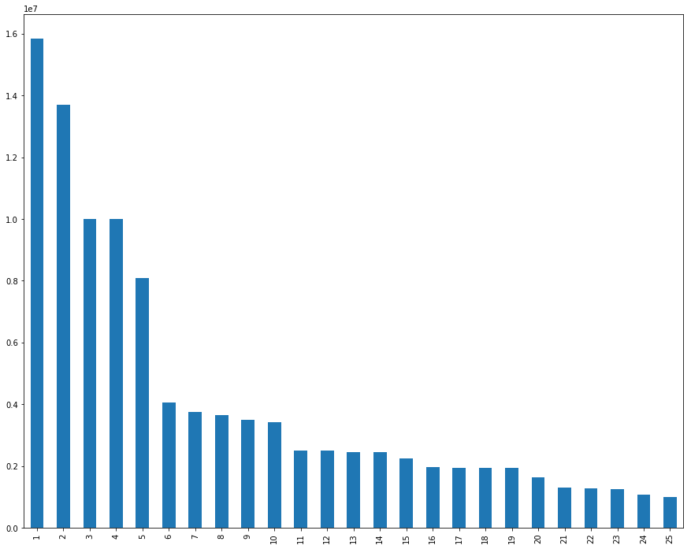

Title:NFL Salary Scraping - Part 2
Date:2017-11-26 17:00
Modified:2010-11-26 17:00
Category:Python, Pelican, misc
Tags:Python, Pandas, Web Scraping, Matplotlib
Slug:nfl-salary-part2
Authors:Wahid Contractor
Summary:Part 2 - Web Scraping NFL Salary Data Using Python

## Background and problem statement

This is the second post in a multi-part post.  If you missed the first post, you can get it [here](https://wcontractor.github.io/nfl-salary.html).  In part 2 of this post I'm am looking to collect all the NFL Salary cap data from the 32 teams spread over individual webpages from www.spoctrac.com and merge that into 1 large data set.  This final data set can then be used to answer questions such as:
- Who are the highest paid players in the NFL?
- Which positions are the highest paid?
- For those players that are highest paid where do they rank statistically?
- For those teams that have the highest paid positions where do they rank statistically?  Football is after all a team sport :football:
- And to be push the limits is there a correlation between the number of times a player is mentioned on twitter and their salary?

## Imports and Function definitions
Throughout this post I'm using the BeautifulSoup library to parse the webpage and the urllib library to get pages.  I have also defined 2 functions to support this.
- get_page is used to build a list of 32 URLS, 1 for each of the teams that will be used iterated over and parsed using the next function.  
- get_team_table accepts a url, opens that as a page, and then uses BeautufilSoup to parse it and return a soup object.  


```python
from urllib.request import urlopen
from bs4 import BeautifulSoup
base_url = "http://www.spotrac.com/nfl/"

def get_page(url):
    page = urlopen(base_url)
    soup = BeautifulSoup(page, 'lxml')
    file = open("spotrac_urls.txt", 'w')
    file.write(str(soup))
    file.close()

def get_team_table(url):
    page = urlopen(url)
    soup = BeautifulSoup(page, 'lxml')
```

## Get all the BASE URLS
The http://www.spotrac.com/nfl/ has links for each of the 32 NFL teams.  On those pages there is a datatable that has that teams Salary cap data.  To get those links so that they can be used later used the get_page function and write the contents to a file.


```python
get_page(base_url)
```


```python
with open("spotrac_urls.txt", 'r') as file:
    for line in file:
        line = line.strip()
```


```python
from bs4 import BeautifulSoup
page = open("spotrac_urls.txt", 'r')
soup = BeautifulSoup(page, "lxml")
div = soup.find("div","subnav-posts")
```


```python
# This is a terribly simple regex to loop through all the div tags and find all the anchor tags.
# Then I just get the href and print them out.
import re
links = div.find_all('a')
for link in links:
    print(link.get('href'))

len(links)
```

    http://www.spotrac.com/nfl/arizona-cardinals/cap/
    http://www.spotrac.com/nfl/atlanta-falcons/cap/
    http://www.spotrac.com/nfl/baltimore-ravens/cap/
    http://www.spotrac.com/nfl/buffalo-bills/cap/
    http://www.spotrac.com/nfl/carolina-panthers/cap/
    http://www.spotrac.com/nfl/chicago-bears/cap/
    http://www.spotrac.com/nfl/cincinnati-bengals/cap/
    http://www.spotrac.com/nfl/cleveland-browns/cap/
    http://www.spotrac.com/nfl/dallas-cowboys/cap/
    http://www.spotrac.com/nfl/denver-broncos/cap/
    http://www.spotrac.com/nfl/detroit-lions/cap/
    http://www.spotrac.com/nfl/green-bay-packers/cap/
    http://www.spotrac.com/nfl/houston-texans/cap/
    http://www.spotrac.com/nfl/indianapolis-colts/cap/
    http://www.spotrac.com/nfl/jacksonville-jaguars/cap/
    http://www.spotrac.com/nfl/kansas-city-chiefs/cap/
    http://www.spotrac.com/nfl/los-angeles-chargers/cap/
    http://www.spotrac.com/nfl/los-angeles-rams/cap/
    http://www.spotrac.com/nfl/miami-dolphins/cap/
    http://www.spotrac.com/nfl/minnesota-vikings/cap/
    http://www.spotrac.com/nfl/new-england-patriots/cap/
    http://www.spotrac.com/nfl/new-orleans-saints/cap/
    http://www.spotrac.com/nfl/new-york-giants/cap/
    http://www.spotrac.com/nfl/new-york-jets/cap/
    http://www.spotrac.com/nfl/oakland-raiders/cap/
    http://www.spotrac.com/nfl/philadelphia-eagles/cap/
    http://www.spotrac.com/nfl/pittsburgh-steelers/cap/
    http://www.spotrac.com/nfl/san-francisco-49ers/cap/
    http://www.spotrac.com/nfl/seattle-seahawks/cap/
    http://www.spotrac.com/nfl/tampa-bay-buccaneers/cap/
    http://www.spotrac.com/nfl/tennessee-titans/cap/
    http://www.spotrac.com/nfl/washington-redskins/cap/


    32


```python

from urllib.request import urlopen
def get_team_table(url):
    page = urlopen(url)
    soup = BeautifulSoup(page, 'lxml')
    data_rows = [row for row in soup.find("table", "datatable").find_all("tr")]
    return data_rows

```

## Get the data
For all 32 teams we get the table rows using the get_team_table functions


```python
# create an empty list
team_data = []

for link in links:
    team_data.append(get_team_table(link.get('href')))

```


```python
#Make sure there are 32 elements in team_data
len(team_data)

```


    32


## The heavy lifting
Build player_data from the combined table rows that were parsed from all the links above.  This takes some time to execute.  


```python
#data_rows = [row for row in soup.find("td", "center").find_all("tr")]
table_data = []

#soup = BeautifulSoup(team_data[0], 'lxml')

#This needs to be a nested for loop because inner items of the list are BeautifulSoup Elements
for row in team_data:
    for element in row:
        #print(type(element))
        if soup.find_all("td", attrs={"class":" right xs-hide "}) is not None:
            table_data.append(element.get_text())

player_data = []
for row in table_data:
    player_data.append(row.split("\n"))
    #print(player_data)

len(player_data)    

```


    1725


## Loada DataFrame and reshape the data
In the next cells I load the data into a DataFrame and reshape it so that it has 12 columns, fix the header, and remove the invalid rows


```python
import pandas as pd
df = pd.DataFrame(player_data)
df = df.drop(14, 1)
df = df.drop(0, 1)
df = df.drop(1, 1)


df = df.drop(df.index[[0]])
#df.set_index(1, inplace=True)
print(df.shape)
df.head()

```

    (1724, 12)


<div>
<style>
    .dataframe thead tr:only-child th {
        text-align: right;
    }

    .dataframe thead th {
        text-align: left;
    }

    .dataframe tbody tr th {
        vertical-align: top;
    }
</style>
<table border="1" class="dataframe">
  <thead>
    <tr style="text-align: right;">
      <th></th>
      <th>2</th>
      <th>3</th>
      <th>4</th>
      <th>5</th>
      <th>6</th>
      <th>7</th>
      <th>8</th>
      <th>9</th>
      <th>10</th>
      <th>11</th>
      <th>12</th>
      <th>13</th>
    </tr>
  </thead>
  <tbody>
    <tr>
      <th>1</th>
      <td>Larry Fitzgerald</td>
      <td>WR</td>
      <td>$11,000,000</td>
      <td>$2,500,000</td>
      <td>-</td>
      <td>-</td>
      <td>-</td>
      <td>$2,350,000</td>
      <td>-</td>
      <td>-</td>
      <td>$15,850,000</td>
      <td>9.44</td>
    </tr>
    <tr>
      <th>2</th>
      <td>Patrick Peterson</td>
      <td>CB</td>
      <td>$9,750,000</td>
      <td>$3,072,377</td>
      <td>-</td>
      <td>-</td>
      <td>$250,000</td>
      <td>$634,588</td>
      <td>-</td>
      <td>($18,048,518)</td>
      <td>$13,706,965</td>
      <td>8.16</td>
    </tr>
    <tr>
      <th>3</th>
      <td>Chandler Jones</td>
      <td>OLB</td>
      <td>$7,000,000</td>
      <td>$3,000,000</td>
      <td>-</td>
      <td>-</td>
      <td>-</td>
      <td>-</td>
      <td>-</td>
      <td>($31,000,000)</td>
      <td>$10,000,000</td>
      <td>5.96</td>
    </tr>
    <tr>
      <th>4</th>
      <td>Jared Veldheer</td>
      <td>RT</td>
      <td>$6,500,000</td>
      <td>$1,250,000</td>
      <td>$250,000</td>
      <td>-</td>
      <td>-</td>
      <td>$2,000,000</td>
      <td>-</td>
      <td>($6,500,000)</td>
      <td>$10,000,000</td>
      <td>5.96</td>
    </tr>
    <tr>
      <th>5</th>
      <td>Tyrann Mathieu</td>
      <td>FS</td>
      <td>$4,750,000</td>
      <td>$3,100,000</td>
      <td>-</td>
      <td>-</td>
      <td>$250,000</td>
      <td>-</td>
      <td>-</td>
      <td>($17,400,000)</td>
      <td>$8,100,000</td>
      <td>4.82</td>
    </tr>
  </tbody>
</table>
</div>


```python
players = []
for row in team_data[0]:
    if row.get_text("tr") is not None:
        players.append(row) 

column_headers = [col.get_text() for col in players[0].find_all("th") if col.get_text()]
len(column_headers)
```


    12


```python
df.columns = column_headers
df.head()
```


<div>
<style>
    .dataframe thead tr:only-child th {
        text-align: right;
    }

    .dataframe thead th {
        text-align: left;
    }

    .dataframe tbody tr th {
        vertical-align: top;
    }
</style>
<table border="1" class="dataframe">
  <thead>
    <tr style="text-align: right;">
      <th></th>
      <th>Active Players  (53)</th>
      <th>Pos.</th>
      <th>Base Salary</th>
      <th>Signing Bonus</th>
      <th>Roster Bonus</th>
      <th>Option Bonus</th>
      <th>Workout Bonus</th>
      <th>Restruc. Bonus</th>
      <th>Misc.</th>
      <th>Dead Cap</th>
      <th>Cap Hit</th>
      <th>Cap %</th>
    </tr>
  </thead>
  <tbody>
    <tr>
      <th>1</th>
      <td>Larry Fitzgerald</td>
      <td>WR</td>
      <td>$11,000,000</td>
      <td>$2,500,000</td>
      <td>-</td>
      <td>-</td>
      <td>-</td>
      <td>$2,350,000</td>
      <td>-</td>
      <td>-</td>
      <td>$15,850,000</td>
      <td>9.44</td>
    </tr>
    <tr>
      <th>2</th>
      <td>Patrick Peterson</td>
      <td>CB</td>
      <td>$9,750,000</td>
      <td>$3,072,377</td>
      <td>-</td>
      <td>-</td>
      <td>$250,000</td>
      <td>$634,588</td>
      <td>-</td>
      <td>($18,048,518)</td>
      <td>$13,706,965</td>
      <td>8.16</td>
    </tr>
    <tr>
      <th>3</th>
      <td>Chandler Jones</td>
      <td>OLB</td>
      <td>$7,000,000</td>
      <td>$3,000,000</td>
      <td>-</td>
      <td>-</td>
      <td>-</td>
      <td>-</td>
      <td>-</td>
      <td>($31,000,000)</td>
      <td>$10,000,000</td>
      <td>5.96</td>
    </tr>
    <tr>
      <th>4</th>
      <td>Jared Veldheer</td>
      <td>RT</td>
      <td>$6,500,000</td>
      <td>$1,250,000</td>
      <td>$250,000</td>
      <td>-</td>
      <td>-</td>
      <td>$2,000,000</td>
      <td>-</td>
      <td>($6,500,000)</td>
      <td>$10,000,000</td>
      <td>5.96</td>
    </tr>
    <tr>
      <th>5</th>
      <td>Tyrann Mathieu</td>
      <td>FS</td>
      <td>$4,750,000</td>
      <td>$3,100,000</td>
      <td>-</td>
      <td>-</td>
      <td>$250,000</td>
      <td>-</td>
      <td>-</td>
      <td>($17,400,000)</td>
      <td>$8,100,000</td>
      <td>4.82</td>
    </tr>
  </tbody>
</table>
</div>


```python
#The header repeated itself in the data.  This didn't reveal itself until the data type conversion step below
#but this fixes all occurrences of it.
rows_to_be_dropped = df.loc[df['Cap Hit'] == 'Cap %'].index
df = df.drop(rows_to_be_dropped)

```


```python
#Apply a regex to convert the 'Cap Hit' column from a string to a float.  
df['Cap Hit'] =(df['Cap Hit'].replace('[\$,)]', "", regex=True).replace( '[(]','-',   regex=True ).astype(float))

#Sanity check to make sure it worked.
df['Cap Hit'].sum()
```


    4159332264.0


```python
df.shape
#53*32 = 1696 there should be this many rows in the data set, how did I end up with 3 extra??
#That's such an odd number?
```


    (1693, 13)


```python
import matplotlib.pyplot as plt
df['Cap Hit'].head(25).plot(kind="bar",figsize=(15,12))
plt.show()
```





```python
df['Cap Average By Game'] = df['Cap Hit']/16
```


```python
df.head(25)
#Assuming 16 games & all his bunuses - Larry Fitzgerald makes $9.9M a game!!
```


<div>
<style>
    .dataframe thead tr:only-child th {
        text-align: right;
    }

    .dataframe thead th {
        text-align: left;
    }

    .dataframe tbody tr th {
        vertical-align: top;
    }
</style>
<table border="1" class="dataframe">
  <thead>
    <tr style="text-align: right;">
      <th></th>
      <th>Active Players  (53)</th>
      <th>Pos.</th>
      <th>Base Salary</th>
      <th>Signing Bonus</th>
      <th>Roster Bonus</th>
      <th>Option Bonus</th>
      <th>Workout Bonus</th>
      <th>Restruc. Bonus</th>
      <th>Misc.</th>
      <th>Dead Cap</th>
      <th>Cap Hit</th>
      <th>Cap %</th>
      <th>Cap Average By Game</th>
    </tr>
  </thead>
  <tbody>
    <tr>
      <th>1</th>
      <td>Larry Fitzgerald</td>
      <td>WR</td>
      <td>$11,000,000</td>
      <td>$2,500,000</td>
      <td>-</td>
      <td>-</td>
      <td>-</td>
      <td>$2,350,000</td>
      <td>-</td>
      <td>-</td>
      <td>15850000.0</td>
      <td>9.44</td>
      <td>990625.0000</td>
    </tr>
    <tr>
      <th>2</th>
      <td>Patrick Peterson</td>
      <td>CB</td>
      <td>$9,750,000</td>
      <td>$3,072,377</td>
      <td>-</td>
      <td>-</td>
      <td>$250,000</td>
      <td>$634,588</td>
      <td>-</td>
      <td>($18,048,518)</td>
      <td>13706965.0</td>
      <td>8.16</td>
      <td>856685.3125</td>
    </tr>
    <tr>
      <th>3</th>
      <td>Chandler Jones</td>
      <td>OLB</td>
      <td>$7,000,000</td>
      <td>$3,000,000</td>
      <td>-</td>
      <td>-</td>
      <td>-</td>
      <td>-</td>
      <td>-</td>
      <td>($31,000,000)</td>
      <td>10000000.0</td>
      <td>5.96</td>
      <td>625000.0000</td>
    </tr>
    <tr>
      <th>4</th>
      <td>Jared Veldheer</td>
      <td>RT</td>
      <td>$6,500,000</td>
      <td>$1,250,000</td>
      <td>$250,000</td>
      <td>-</td>
      <td>-</td>
      <td>$2,000,000</td>
      <td>-</td>
      <td>($6,500,000)</td>
      <td>10000000.0</td>
      <td>5.96</td>
      <td>625000.0000</td>
    </tr>
    <tr>
      <th>5</th>
      <td>Tyrann Mathieu</td>
      <td>FS</td>
      <td>$4,750,000</td>
      <td>$3,100,000</td>
      <td>-</td>
      <td>-</td>
      <td>$250,000</td>
      <td>-</td>
      <td>-</td>
      <td>($17,400,000)</td>
      <td>8100000.0</td>
      <td>4.82</td>
      <td>506250.0000</td>
    </tr>
    <tr>
      <th>6</th>
      <td>Drew Stanton</td>
      <td>QB</td>
      <td>$2,550,000</td>
      <td>$1,000,000</td>
      <td>$500,000</td>
      <td>-</td>
      <td>-</td>
      <td>-</td>
      <td>-</td>
      <td>($3,550,000)</td>
      <td>4050000.0</td>
      <td>2.41</td>
      <td>253125.0000</td>
    </tr>
    <tr>
      <th>7</th>
      <td>Jermaine Gresham</td>
      <td>TE</td>
      <td>$2,000,000</td>
      <td>$1,750,000</td>
      <td>-</td>
      <td>-</td>
      <td>-</td>
      <td>-</td>
      <td>-</td>
      <td>($13,000,000)</td>
      <td>3750000.0</td>
      <td>2.23</td>
      <td>234375.0000</td>
    </tr>
    <tr>
      <th>8</th>
      <td>Corey Peters</td>
      <td>DT</td>
      <td>$2,750,000</td>
      <td>$666,668</td>
      <td>$93,750</td>
      <td>-</td>
      <td>$150,000</td>
      <td>-</td>
      <td>-</td>
      <td>($3,566,668)</td>
      <td>3660418.0</td>
      <td>2.18</td>
      <td>228776.1250</td>
    </tr>
    <tr>
      <th>9</th>
      <td>Justin Bethel</td>
      <td>CB</td>
      <td>$2,000,000</td>
      <td>$1,500,000</td>
      <td>-</td>
      <td>-</td>
      <td>-</td>
      <td>-</td>
      <td>-</td>
      <td>($3,500,000)</td>
      <td>3500000.0</td>
      <td>2.08</td>
      <td>218750.0000</td>
    </tr>
    <tr>
      <th>10</th>
      <td>Antoine Bethea</td>
      <td>SS</td>
      <td>$2,000,000</td>
      <td>$666,666</td>
      <td>$500,000</td>
      <td>-</td>
      <td>$250,000</td>
      <td>-</td>
      <td>-</td>
      <td>($4,250,000)</td>
      <td>3416666.0</td>
      <td>2.04</td>
      <td>213541.6250</td>
    </tr>
    <tr>
      <th>11</th>
      <td>Phil Dawson</td>
      <td>K</td>
      <td>$2,000,000</td>
      <td>$500,000</td>
      <td>-</td>
      <td>-</td>
      <td>-</td>
      <td>-</td>
      <td>-</td>
      <td>($3,000,000)</td>
      <td>2500000.0</td>
      <td>1.49</td>
      <td>156250.0000</td>
    </tr>
    <tr>
      <th>12</th>
      <td>Josh Mauro</td>
      <td>DT</td>
      <td>$750,000</td>
      <td>$500,000</td>
      <td>$1,250,000</td>
      <td>-</td>
      <td>-</td>
      <td>-</td>
      <td>-</td>
      <td>($3,000,000)</td>
      <td>2500000.0</td>
      <td>1.49</td>
      <td>156250.0000</td>
    </tr>
    <tr>
      <th>13</th>
      <td>Deone Bucannon</td>
      <td>ILB</td>
      <td>$1,471,255</td>
      <td>$981,673</td>
      <td>-</td>
      <td>-</td>
      <td>-</td>
      <td>-</td>
      <td>-</td>
      <td>($981,673)</td>
      <td>2452928.0</td>
      <td>1.46</td>
      <td>153308.0000</td>
    </tr>
    <tr>
      <th>14</th>
      <td>Haason Reddick</td>
      <td>ILB</td>
      <td>$465,000</td>
      <td>$1,985,539</td>
      <td>-</td>
      <td>-</td>
      <td>-</td>
      <td>-</td>
      <td>-</td>
      <td>($7,942,157)</td>
      <td>2450539.0</td>
      <td>1.46</td>
      <td>153158.6875</td>
    </tr>
    <tr>
      <th>15</th>
      <td>Karlos Dansby</td>
      <td>ILB</td>
      <td>$1,000,000</td>
      <td>$700,000</td>
      <td>$200,000</td>
      <td>-</td>
      <td>$100,000</td>
      <td>-</td>
      <td>$250,000</td>
      <td>($1,800,000)</td>
      <td>2250000.0</td>
      <td>1.34</td>
      <td>140625.0000</td>
    </tr>
    <tr>
      <th>16</th>
      <td>Robert Nkemdiche</td>
      <td>DE</td>
      <td>$840,936</td>
      <td>$1,113,745</td>
      <td>-</td>
      <td>-</td>
      <td>-</td>
      <td>-</td>
      <td>-</td>
      <td>($6,536,854)</td>
      <td>1954681.0</td>
      <td>1.16</td>
      <td>122167.5625</td>
    </tr>
    <tr>
      <th>17</th>
      <td>Tramon Williams</td>
      <td>CB</td>
      <td>$1,100,000</td>
      <td>$500,000</td>
      <td>$350,000</td>
      <td>-</td>
      <td>-</td>
      <td>-</td>
      <td>-</td>
      <td>($1,600,000)</td>
      <td>1950000.0</td>
      <td>1.16</td>
      <td>121875.0000</td>
    </tr>
    <tr>
      <th>18</th>
      <td>Alex Boone</td>
      <td>G</td>
      <td>$900,000</td>
      <td>-</td>
      <td>$437,500</td>
      <td>-</td>
      <td>-</td>
      <td>-</td>
      <td>$600,000</td>
      <td>($1,400,000)</td>
      <td>1937500.0</td>
      <td>1.15</td>
      <td>121093.7500</td>
    </tr>
    <tr>
      <th>19</th>
      <td>John Brown</td>
      <td>WR</td>
      <td>$1,797,000</td>
      <td>$135,725</td>
      <td>-</td>
      <td>-</td>
      <td>-</td>
      <td>-</td>
      <td>-</td>
      <td>($135,725)</td>
      <td>1932725.0</td>
      <td>1.15</td>
      <td>120795.3125</td>
    </tr>
    <tr>
      <th>20</th>
      <td>A.Q. Shipley</td>
      <td>C</td>
      <td>$775,000</td>
      <td>$362,500</td>
      <td>$250,000</td>
      <td>-</td>
      <td>-</td>
      <td>-</td>
      <td>$250,000</td>
      <td>($1,500,000)</td>
      <td>1637500.0</td>
      <td>0.98</td>
      <td>102343.7500</td>
    </tr>
    <tr>
      <th>21</th>
      <td>Jaron Brown</td>
      <td>WR</td>
      <td>$775,000</td>
      <td>$317,500</td>
      <td>$218,750</td>
      <td>-</td>
      <td>-</td>
      <td>-</td>
      <td>-</td>
      <td>($1,092,500)</td>
      <td>1311250.0</td>
      <td>0.78</td>
      <td>81953.1250</td>
    </tr>
    <tr>
      <th>22</th>
      <td>Troy Niklas</td>
      <td>TE</td>
      <td>$968,632</td>
      <td>$311,509</td>
      <td>-</td>
      <td>-</td>
      <td>-</td>
      <td>-</td>
      <td>-</td>
      <td>($311,509)</td>
      <td>1280141.0</td>
      <td>0.76</td>
      <td>80008.8125</td>
    </tr>
    <tr>
      <th>23</th>
      <td>Budda Baker</td>
      <td>S</td>
      <td>$465,000</td>
      <td>$776,819</td>
      <td>-</td>
      <td>-</td>
      <td>-</td>
      <td>-</td>
      <td>-</td>
      <td>($3,882,732)</td>
      <td>1241819.0</td>
      <td>0.74</td>
      <td>77613.6875</td>
    </tr>
    <tr>
      <th>24</th>
      <td>Frostee Rucker</td>
      <td>DT</td>
      <td>$1,000,000</td>
      <td>$80,000</td>
      <td>-</td>
      <td>-</td>
      <td>-</td>
      <td>-</td>
      <td>-</td>
      <td>($1,080,000)</td>
      <td>1080000.0</td>
      <td>0.64</td>
      <td>67500.0000</td>
    </tr>
    <tr>
      <th>25</th>
      <td>Andy Lee</td>
      <td>P</td>
      <td>$1,000,000</td>
      <td>-</td>
      <td>-</td>
      <td>-</td>
      <td>-</td>
      <td>-</td>
      <td>-</td>
      <td>($1,000,000)</td>
      <td>1000000.0</td>
      <td>0.60</td>
      <td>62500.0000</td>
    </tr>
  </tbody>
</table>
</div>

