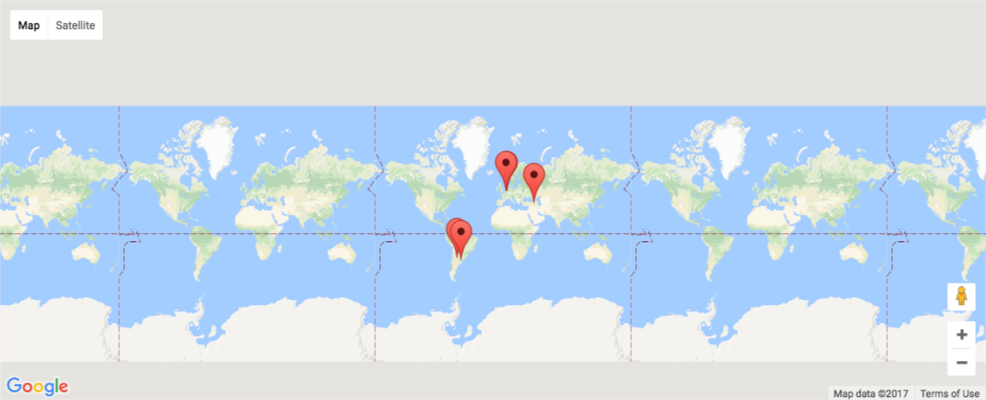
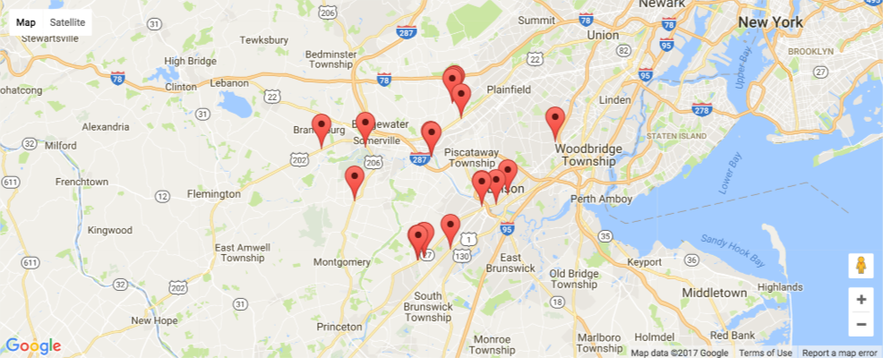

Title:Plot Yelp Halal Restaurants 
Date:2017-12-24 17:00
Modified:2017-12-24 17:00
Category:Python
Tags:Python
Slug:plot-halal-restaurants
Authors:Wahid Contractor
Summary:Plot Halal Restaurants from Yelp using Google Maps API

# Background and Overview
In my first 2 Python related posts I used techniques to scrape data from the web and turn that into information.  In case you missed it check out my [NFL Salary Scraping Part 1](https://wcontractor.github.io/nfl-salary.html) and [Part 2](https://wcontractor.github.io/nfl-salary-part2.html) where I show how to use requests, BeautifulSoup, Pandas, and Matplotlib to learn that the highest paid players in the NFL in 2017 are Larry Fitzgerald and Patrick Peterson.

This post is an evolution from those posts, instead of using scraping data I'm using the Yelp and Google maps APIs to collect information and present the results on a map with markers.

For context I used the Yelp Fusion API to peform a business search for term of 'halal'.  Now by no means am I an expert on this topic, but the word halal mean permissable to eat and my wife and my wife and I frequent these restaurants so I thought it would be interesting to map those locations near our house.


```python
#imports using json, gmaps, and pandas
import json, gmaps
import pandas as pd
```

## Load Data
Admittedly to get the data from the Yelp API I used Postman instead of interfacing with the API directly.  This was just faster to get a JSON file of the results I was looking for.  To do this you need to create an app and get an API Key from Yelps Developer website.  I saved the results from Postman into a text file and then worked locally from there.


```python
with open("Yelp_Halal_Businesses.JSON", 'r') as file:
    data = file.read()

json_data = json.loads(data)
```

## Get Locations

In the cell below I iterate over the items in json_Data and create 2 lists that store that latitude and longitude.  I then zip those 2 lists together to create 1 so that I can pass the coordinates of the halal restaurants to gmaps.


```python

lat = []
long = []
for item in json_data['businesses']:
    lat.append(item['coordinates']['latitude'])
    long.append(item['coordinates']['longitude'])

lat_long = list((zip(lat,long)))
lat_long
```


    [(40.56378, -74.694418),
     (40.5661650002003, -74.6275533735752),
     (40.55492, -74.52609),
     (40.5036928033583, -74.6444269892345),
     (40.62008, -74.49021),
     (40.55527, -74.52661),
     (40.598919, -74.480728),
     (40.437622, -74.538564),
     (40.6171176417404, -74.494637063977),
     (40.61933, -74.4927699),
     (40.4340821413289, -74.5478186003373),
     (40.62008, -74.49021),
     (40.4473744, -74.4966087),
     (40.4974297303228, -74.4482234326057),
     (40.4379627796526, -74.5361950967858),
     (40.5104061, -74.409281),
     (40.4345526013837, -74.5460039343956),
     (40.4977595713994, -74.4490539963252),
     (40.5721031, -74.3360702),
     (40.4992091, -74.4272637)]


## Test the Google Maps API
The code snippet below is a copy/paste from the gmaps documentation.  I did this to make sure I had the Google API Key setup correctly.  

The information in gmaps documenation is really quite good.  Check it out [jupyter-gmaps.pdf](https://media.readthedocs.org/pdf/jupyter-gmaps/latest/jupyter-gmaps.pdf) 


```python

gmaps.configure(api_key="AI...")
marker_locations = [
(-34.0, -59.166672),
(-32.23333, -64.433327),
(40.166672, 44.133331),
(51.216671, 5.0833302),
(51.333328, 4.25)
]
fig = gmaps.figure()
markers = gmaps.marker_layer(marker_locations)
fig.add_layer(markers)
fig
```


    A Jupyter Widget


```python
%%HTML

```


## Plot the locations


```python
from ipywidgets.embed import embed_minimal_html

fig = gmaps.figure()
markers = gmaps.marker_layer(lat_long)
fig.add_layer(markers)

embed_minimal_html('export.html', views=[fig])
```


```python
%%HTML

```


