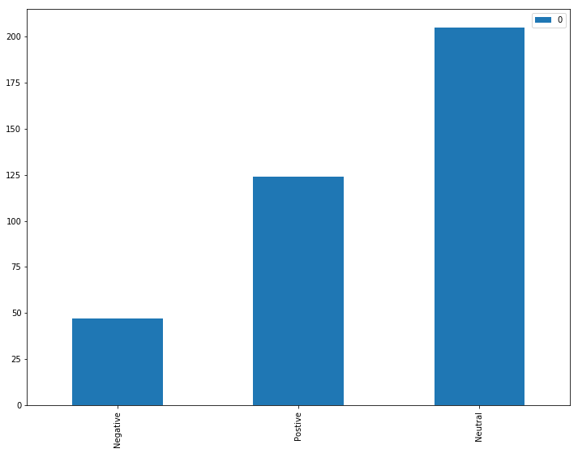

Title:World Cup Tweet Sentiment Analysis
Date:2018-07-18 10:20
Modified:2018-07-18 19:30
Category:Python, misc
Tags:Python, Pandas, Matplotlib, NLP
Slug:sentiment-analysis
Authors:Wahid Contractor
Summary:Sentiment Analysis of World Cup Tweets During England VS. Croatia
## Background

Normally I open these posts with some background about what I'm trying to accomplish, some perspective about my thought process as I worked through the problem, and just a little bit about the why.  I have been away for some time though, It was my intention to work through a mini-project at least once a month and turn that into a post. It has been some time since my last post. Life has taken over, my wife and I have a 6 month old baby girl and she keeps us very busy. However, my passion for learning, building, and creating 


```python
import os, json, pprint
import pandas as pd
```


```python
from nltk.corpus import stopwords
from nltk import sent_tokenize

pd.options.display.max_rows
pd.set_option('display.max_colwidth', -1)
```


```python


tweet_data = []
tweet_file = open('world_cup_tweets.txt', 'r')
for line in tweet_file:
    try:
        tweet = json.loads(line)
        tweet_data.append(tweet)
    except:
        continue

len(tweet_data)
```


    376


```python
df = pd.DataFrame(tweet_data)
print('There are', df.shape[0], ' rows and', df.shape[1], ' columns in this dataset')
df.columns
```

    There are 376  rows and 37  columns in this dataset


    Index(['contributors', 'coordinates', 'created_at', 'display_text_range',
           'entities', 'extended_entities', 'extended_tweet', 'favorite_count',
           'favorited', 'filter_level', 'geo', 'id', 'id_str',
           'in_reply_to_screen_name', 'in_reply_to_status_id',
           'in_reply_to_status_id_str', 'in_reply_to_user_id',
           'in_reply_to_user_id_str', 'is_quote_status', 'lang', 'limit', 'place',
           'possibly_sensitive', 'quote_count', 'quoted_status',
           'quoted_status_id', 'quoted_status_id_str', 'quoted_status_permalink',
           'reply_count', 'retweet_count', 'retweeted', 'retweeted_status',
           'source', 'text', 'timestamp_ms', 'truncated', 'user'],
          dtype='object')


## Drop unnecessary columns
There are a siginifance number of attributes on this data set that will not be used.  This step removes the unnessary columns.  


```python
df.drop(['contributors', 'coordinates', 'extended_tweet', 'geo', 'created_at', 'display_text_range',
       'entities', 'extended_entities', 'favorite_count',
       'favorited', 'filter_level', 'id', 'id_str',
       'in_reply_to_screen_name', 'in_reply_to_status_id',
       'in_reply_to_status_id_str', 'in_reply_to_user_id',
       'in_reply_to_user_id_str', 'is_quote_status', 'limit',
       'possibly_sensitive', 'quote_count', 'quoted_status',
       'quoted_status_id', 'quoted_status_id_str', 'quoted_status_permalink',
       'reply_count', 'retweet_count', 'retweeted', 'retweeted_status',
       'source','timestamp_ms', 'truncated', 'user'], axis=1, inplace=True)
df.shape
```


    (376, 3)


```python
df.dtypes
```


    lang     object
    place    object
    text     object
    dtype: object


# Fill in NAN's 

There are rows where the text value is NAN and that is causing the pre-processing steps to error with a data type error.  Perhaps I could have filtered them out, but I chose to use fillna to fill them in with spaces.  


```python
df.text.fillna("", inplace=True)
df.text.dtype
```


    dtype('O')


```python
#df['cleaned'] = df['text'].str.replace('[^\w\s]', '')
#from nltk.corpus import stopwords
#stop = stopwords.words('english')
#df['text'] = df['text'].apply(lambda x: " ".join(x for x in x.split() if x not in stop))
#df['text'].head()

df['word_count'] = df['text'].apply(lambda x: len(str(x).split(" ")))
df.head(10)
```


<div>
<style>
    .dataframe thead tr:only-child th {
        text-align: right;
    }

    .dataframe thead th {
        text-align: left;
    }

    .dataframe tbody tr th {
        vertical-align: top;
    }
</style>
<table border="1" class="dataframe">
  <thead>
    <tr style="text-align: right;">
      <th></th>
      <th>lang</th>
      <th>place</th>
      <th>text</th>
      <th>word_count</th>
    </tr>
  </thead>
  <tbody>
    <tr>
      <th>0</th>
      <td>en</td>
      <td>None</td>
      <td>This. https://t.co/UNKep8L5EY</td>
      <td>2</td>
    </tr>
    <tr>
      <th>1</th>
      <td>en</td>
      <td>None</td>
      <td>Wanna see England in the final but Croatia is clearly the better side\n\n#ENGCRO #WorldCup</td>
      <td>14</td>
    </tr>
    <tr>
      <th>2</th>
      <td>en</td>
      <td>None</td>
      <td>C’mon #England we really can do this. Dig deep. #EnglandvsCroatia #ThreeLionsOnAShirt</td>
      <td>11</td>
    </tr>
    <tr>
      <th>3</th>
      <td>en</td>
      <td>None</td>
      <td>RT @FlickSaudi: If England lose This is How The Streets Of London Will Look https://t.co/V8AT2RRn5p</td>
      <td>15</td>
    </tr>
    <tr>
      <th>4</th>
      <td>en</td>
      <td>None</td>
      <td>RT @hermannkelly: .@TonightShowTV3 I’m into the breach on the TV3 Tonight Show, Wednesday 11th July at 11pm. #WorldCup⁠ ⁠⁠ ⁠ \nAs we already…</td>
      <td>23</td>
    </tr>
    <tr>
      <th>5</th>
      <td>th</td>
      <td>None</td>
      <td>RT @mthai: เกมส์ยัง​ไม่จบ... ต่อเวลาพิเศษ​ 30  นาที\n\nโครเอเชีย​ 🇭🇷       1  :   1         🏴󠁧󠁢󠁥󠁮󠁧󠁿​ อังกฤษ​\n เปริซิช  68'              ⚽…</td>
      <td>47</td>
    </tr>
    <tr>
      <th>6</th>
      <td>en</td>
      <td>None</td>
      <td>William made an England flag at nursery today. I hope he gets the need for it on Sunday. #ENGvCRO… https://t.co/Cjf76wWtPG</td>
      <td>20</td>
    </tr>
    <tr>
      <th>7</th>
      <td>en</td>
      <td>None</td>
      <td>This is why england can never win d world cup again argue with ur ancestors #ENGCRO</td>
      <td>16</td>
    </tr>
    <tr>
      <th>8</th>
      <td>en</td>
      <td>None</td>
      <td>RT @PurelyFootball: Hyde Park when Kieran Trippier scored for England🏴󠁧󠁢󠁥󠁮󠁧󠁿\n\nAbsolute scenes!🍻 https://t.co/SLb6dFcG0g</td>
      <td>12</td>
    </tr>
    <tr>
      <th>9</th>
      <td>en</td>
      <td>None</td>
      <td>Honestly? I’m ashamed about the protests in England... I’m ashamed we aren’t as organized and doing as much protest… https://t.co/JBLcWtfgsX</td>
      <td>20</td>
    </tr>
  </tbody>
</table>
</div>


## Punctuation removal


```python
import string
df['no_punctuation'] = df['text'].str.replace('[^\w\s]','')
df.head()
```


<div>
<style>
    .dataframe thead tr:only-child th {
        text-align: right;
    }

    .dataframe thead th {
        text-align: left;
    }

    .dataframe tbody tr th {
        vertical-align: top;
    }
</style>
<table border="1" class="dataframe">
  <thead>
    <tr style="text-align: right;">
      <th></th>
      <th>lang</th>
      <th>place</th>
      <th>text</th>
      <th>word_count</th>
      <th>no_punctuation</th>
    </tr>
  </thead>
  <tbody>
    <tr>
      <th>0</th>
      <td>en</td>
      <td>None</td>
      <td>This. https://t.co/UNKep8L5EY</td>
      <td>2</td>
      <td>This httpstcoUNKep8L5EY</td>
    </tr>
    <tr>
      <th>1</th>
      <td>en</td>
      <td>None</td>
      <td>Wanna see England in the final but Croatia is clearly the better side\n\n#ENGCRO #WorldCup</td>
      <td>14</td>
      <td>Wanna see England in the final but Croatia is clearly the better side\n\nENGCRO WorldCup</td>
    </tr>
    <tr>
      <th>2</th>
      <td>en</td>
      <td>None</td>
      <td>C’mon #England we really can do this. Dig deep. #EnglandvsCroatia #ThreeLionsOnAShirt</td>
      <td>11</td>
      <td>Cmon England we really can do this Dig deep EnglandvsCroatia ThreeLionsOnAShirt</td>
    </tr>
    <tr>
      <th>3</th>
      <td>en</td>
      <td>None</td>
      <td>RT @FlickSaudi: If England lose This is How The Streets Of London Will Look https://t.co/V8AT2RRn5p</td>
      <td>15</td>
      <td>RT FlickSaudi If England lose This is How The Streets Of London Will Look httpstcoV8AT2RRn5p</td>
    </tr>
    <tr>
      <th>4</th>
      <td>en</td>
      <td>None</td>
      <td>RT @hermannkelly: .@TonightShowTV3 I’m into the breach on the TV3 Tonight Show, Wednesday 11th July at 11pm. #WorldCup⁠ ⁠⁠ ⁠ \nAs we already…</td>
      <td>23</td>
      <td>RT hermannkelly TonightShowTV3 Im into the breach on the TV3 Tonight Show Wednesday 11th July at 11pm WorldCup   \nAs we already</td>
    </tr>
  </tbody>
</table>
</div>


```python
from bs4 import BeautifulSoup
import re
from nltk.tokenize import WordPunctTokenizer
tok = WordPunctTokenizer()
pat1 = r'@[A-Za-z0-9]+'
pat2 = r'https?://[A-Za-z0-9./]+'
combined_pat = r'|'.join((pat1, pat2))


def tweet_cleaner(text):
    soup = BeautifulSoup(text, 'lxml')
    souped = soup.get_text()
    stripped = re.sub(combined_pat, '', souped)
    try:
        clean = stripped.decode("utf-8-sig").replace(u"\ufffd", "?")
    except:
        clean = stripped
        letters_only = re.sub("[^a-zA-Z]", " ", clean)
        lower_case = letters_only.lower()
    # During the letters_only process two lines above, it has created unnecessay white spaces,
    # I will tokenize and join together to remove unneccessary white spaces
        words = tok.tokenize(lower_case)
    return (" ".join(words)).strip()


result = []

for tweet in df.text:
    result.append(tweet_cleaner(tweet))

df['cleaned'] = result

df.head(20)

```


<div>
<style>
    .dataframe thead tr:only-child th {
        text-align: right;
    }

    .dataframe thead th {
        text-align: left;
    }

    .dataframe tbody tr th {
        vertical-align: top;
    }
</style>
<table border="1" class="dataframe">
  <thead>
    <tr style="text-align: right;">
      <th></th>
      <th>lang</th>
      <th>place</th>
      <th>text</th>
      <th>word_count</th>
      <th>no_punctuation</th>
      <th>cleaned</th>
    </tr>
  </thead>
  <tbody>
    <tr>
      <th>0</th>
      <td>en</td>
      <td>None</td>
      <td>This. https://t.co/UNKep8L5EY</td>
      <td>2</td>
      <td>This httpstcoUNKep8L5EY</td>
      <td>this</td>
    </tr>
    <tr>
      <th>1</th>
      <td>en</td>
      <td>None</td>
      <td>Wanna see England in the final but Croatia is clearly the better side\n\n#ENGCRO #WorldCup</td>
      <td>14</td>
      <td>Wanna see England in the final but Croatia is clearly the better side\n\nENGCRO WorldCup</td>
      <td>wanna see england in the final but croatia is clearly the better side engcro worldcup</td>
    </tr>
    <tr>
      <th>2</th>
      <td>en</td>
      <td>None</td>
      <td>C’mon #England we really can do this. Dig deep. #EnglandvsCroatia #ThreeLionsOnAShirt</td>
      <td>11</td>
      <td>Cmon England we really can do this Dig deep EnglandvsCroatia ThreeLionsOnAShirt</td>
      <td>c mon england we really can do this dig deep englandvscroatia threelionsonashirt</td>
    </tr>
    <tr>
      <th>3</th>
      <td>en</td>
      <td>None</td>
      <td>RT @FlickSaudi: If England lose This is How The Streets Of London Will Look https://t.co/V8AT2RRn5p</td>
      <td>15</td>
      <td>RT FlickSaudi If England lose This is How The Streets Of London Will Look httpstcoV8AT2RRn5p</td>
      <td>rt if england lose this is how the streets of london will look</td>
    </tr>
    <tr>
      <th>4</th>
      <td>en</td>
      <td>None</td>
      <td>RT @hermannkelly: .@TonightShowTV3 I’m into the breach on the TV3 Tonight Show, Wednesday 11th July at 11pm. #WorldCup⁠ ⁠⁠ ⁠ \nAs we already…</td>
      <td>23</td>
      <td>RT hermannkelly TonightShowTV3 Im into the breach on the TV3 Tonight Show Wednesday 11th July at 11pm WorldCup   \nAs we already</td>
      <td>rt i m into the breach on the tv tonight show wednesday th july at pm worldcup as we already</td>
    </tr>
    <tr>
      <th>5</th>
      <td>th</td>
      <td>None</td>
      <td>RT @mthai: เกมส์ยัง​ไม่จบ... ต่อเวลาพิเศษ​ 30  นาที\n\nโครเอเชีย​ 🇭🇷       1  :   1         🏴󠁧󠁢󠁥󠁮󠁧󠁿​ อังกฤษ​\n เปริซิช  68'              ⚽…</td>
      <td>47</td>
      <td>RT mthai เกมสยงไมจบ ตอเวลาพเศษ 30  นาท\n\nโครเอเชย        1     1          องกฤษ\n เปรซช  68</td>
      <td>rt</td>
    </tr>
    <tr>
      <th>6</th>
      <td>en</td>
      <td>None</td>
      <td>William made an England flag at nursery today. I hope he gets the need for it on Sunday. #ENGvCRO… https://t.co/Cjf76wWtPG</td>
      <td>20</td>
      <td>William made an England flag at nursery today I hope he gets the need for it on Sunday ENGvCRO httpstcoCjf76wWtPG</td>
      <td>william made an england flag at nursery today i hope he gets the need for it on sunday engvcro</td>
    </tr>
    <tr>
      <th>7</th>
      <td>en</td>
      <td>None</td>
      <td>This is why england can never win d world cup again argue with ur ancestors #ENGCRO</td>
      <td>16</td>
      <td>This is why england can never win d world cup again argue with ur ancestors ENGCRO</td>
      <td>this is why england can never win d world cup again argue with ur ancestors engcro</td>
    </tr>
    <tr>
      <th>8</th>
      <td>en</td>
      <td>None</td>
      <td>RT @PurelyFootball: Hyde Park when Kieran Trippier scored for England🏴󠁧󠁢󠁥󠁮󠁧󠁿\n\nAbsolute scenes!🍻 https://t.co/SLb6dFcG0g</td>
      <td>12</td>
      <td>RT PurelyFootball Hyde Park when Kieran Trippier scored for England\n\nAbsolute scenes httpstcoSLb6dFcG0g</td>
      <td>rt hyde park when kieran trippier scored for england absolute scenes</td>
    </tr>
    <tr>
      <th>9</th>
      <td>en</td>
      <td>None</td>
      <td>Honestly? I’m ashamed about the protests in England... I’m ashamed we aren’t as organized and doing as much protest… https://t.co/JBLcWtfgsX</td>
      <td>20</td>
      <td>Honestly Im ashamed about the protests in England Im ashamed we arent as organized and doing as much protest httpstcoJBLcWtfgsX</td>
      <td>honestly i m ashamed about the protests in england i m ashamed we aren t as organized and doing as much protest</td>
    </tr>
    <tr>
      <th>10</th>
      <td>en</td>
      <td>None</td>
      <td>RT @SavageLord10: Snap back thou  this an old video guyz help me go viral tag @Aylo_SA @tloucolt @shelm_eric @flickice #imsorrychallenge #M…</td>
      <td>22</td>
      <td>RT SavageLord10 Snap back thou  this an old video guyz help me go viral tag Aylo_SA tloucolt shelm_eric flickice imsorrychallenge M</td>
      <td>rt snap back thou this an old video guyz help me go viral tag sa eric imsorrychallenge m</td>
    </tr>
    <tr>
      <th>11</th>
      <td>en</td>
      <td>None</td>
      <td>RT @petertimmins3: If Croatia win by cheating tonight, I expect at least 17million people to respect the result. Especially you, @JuliaHB1</td>
      <td>21</td>
      <td>RT petertimmins3 If Croatia win by cheating tonight I expect at least 17million people to respect the result Especially you JuliaHB1</td>
      <td>rt if croatia win by cheating tonight i expect at least million people to respect the result especially you</td>
    </tr>
    <tr>
      <th>12</th>
      <td>en</td>
      <td>None</td>
      <td>RT @KEEMSTAR: England wins \n\nI saw it in a dream</td>
      <td>10</td>
      <td>RT KEEMSTAR England wins \n\nI saw it in a dream</td>
      <td>rt england wins i saw it in a dream</td>
    </tr>
    <tr>
      <th>13</th>
      <td>en</td>
      <td>None</td>
      <td>We’re going a bit Spursy here England 🙈</td>
      <td>8</td>
      <td>Were going a bit Spursy here England</td>
      <td>we re going a bit spursy here england</td>
    </tr>
    <tr>
      <th>14</th>
      <td>en</td>
      <td>None</td>
      <td>RT @Predictionhq: correct score 1-1✔️\nCroatia over 0.5 Team Goals ✔️\nCroatia over 3.5 corners ✔️\nOver 1.5 FT goals \n100% Record https://t.c…</td>
      <td>20</td>
      <td>RT Predictionhq correct score 11\nCroatia over 05 Team Goals \nCroatia over 35 corners \nOver 15 FT goals \n100 Record httpstc</td>
      <td>rt correct score croatia over team goals croatia over corners over ft goals record</td>
    </tr>
    <tr>
      <th>15</th>
      <td>en</td>
      <td>None</td>
      <td>RT @alexandramusic: Literally can’t cope. COME ON ENGLAND !!! 🏴󠁧󠁢󠁥󠁮󠁧󠁿</td>
      <td>10</td>
      <td>RT alexandramusic Literally cant cope COME ON ENGLAND</td>
      <td>rt literally can t cope come on england</td>
    </tr>
    <tr>
      <th>16</th>
      <td>en</td>
      <td>None</td>
      <td>Genuinely feel sick right now #ENGCRO #WorldCup</td>
      <td>7</td>
      <td>Genuinely feel sick right now ENGCRO WorldCup</td>
      <td>genuinely feel sick right now engcro worldcup</td>
    </tr>
    <tr>
      <th>17</th>
      <td>en</td>
      <td>None</td>
      <td>Okay the pace seems to be slightly better for #ENGCRO - not sure it's going to be enough at this stage though. Typi… https://t.co/CXsEmkrss4</td>
      <td>24</td>
      <td>Okay the pace seems to be slightly better for ENGCRO  not sure its going to be enough at this stage though Typi httpstcoCXsEmkrss4</td>
      <td>okay the pace seems to be slightly better for engcro not sure it s going to be enough at this stage though typi</td>
    </tr>
    <tr>
      <th>18</th>
      <td>en</td>
      <td>None</td>
      <td>Ok extra time let’s wrap this up and return England to their natural state; moaning into their pints… https://t.co/8qQLHyjHxN</td>
      <td>19</td>
      <td>Ok extra time lets wrap this up and return England to their natural state moaning into their pints httpstco8qQLHyjHxN</td>
      <td>ok extra time let s wrap this up and return england to their natural state moaning into their pints</td>
    </tr>
    <tr>
      <th>19</th>
      <td>en</td>
      <td>None</td>
      <td>I’d love some sideline reporting from @BarstoolBigCat in the next World Cup</td>
      <td>12</td>
      <td>Id love some sideline reporting from BarstoolBigCat in the next World Cup</td>
      <td>i d love some sideline reporting from in the next world cup</td>
    </tr>
  </tbody>
</table>
</div>


## Stopwords Removal


```python
#stop = set(stopwords.words('english'))
#df['final'] = df['cleaned'].apply(lambda x: [item for item in x if item not in stop])
#df['text'].apply(lambda x: [item for item in x if item not in stop])
```

## Sentiment Analysis
Using Textblob.sentiment to detect the sentiment of the cleaned tweet.  This returns a tuple of polarity and subjectivity.  The polarity is indicative of the sentiment, a positive sentiment will have a value closer to 1 while a negative sentiment will be closer to -1.  


```python

from textblob import TextBlob
train = df.cleaned[:100]
#classifier = NaiveBayesClassifier(train, format=None)

#train.apply(lambda x: TextBlob(x).sentiment)

df['sentiment'] = df['cleaned'].apply(lambda x: TextBlob(x).sentiment[0])
```


```python
df['positive'] = df['sentiment'] > 0
df['negative'] = df['sentiment'] < 0
df['neutral'] = df['sentiment'] == 0

labels = ['Negative','Postive','Neutral']

df_summary = pd.DataFrame([df['negative'].sum(), df['positive'].sum(), df['neutral'].sum()], index=labels)
df_summary

```


<div>
<style>
    .dataframe thead tr:only-child th {
        text-align: right;
    }

    .dataframe thead th {
        text-align: left;
    }

    .dataframe tbody tr th {
        vertical-align: top;
    }
</style>
<table border="1" class="dataframe">
  <thead>
    <tr style="text-align: right;">
      <th></th>
      <th>0</th>
    </tr>
  </thead>
  <tbody>
    <tr>
      <th>Negative</th>
      <td>47</td>
    </tr>
    <tr>
      <th>Postive</th>
      <td>124</td>
    </tr>
    <tr>
      <th>Neutral</th>
      <td>205</td>
    </tr>
  </tbody>
</table>
</div>


```python
from matplotlib import pyplot as plt
%matplotlib inline
fig_size = plt.rcParams["figure.figsize"]
fig_size[0] = 12
fig_size[1] = 9
plt.rcParams["figure.figsize"] = fig_size

```


```python
df_summary.plot(kind='bar');
```





```python
fig = plt.gcf()
fig.set_size_inches(12, 9)
from matplotlib import pyplot as plt
plt.scatter(df.index.values, df['sentiment']);
```


